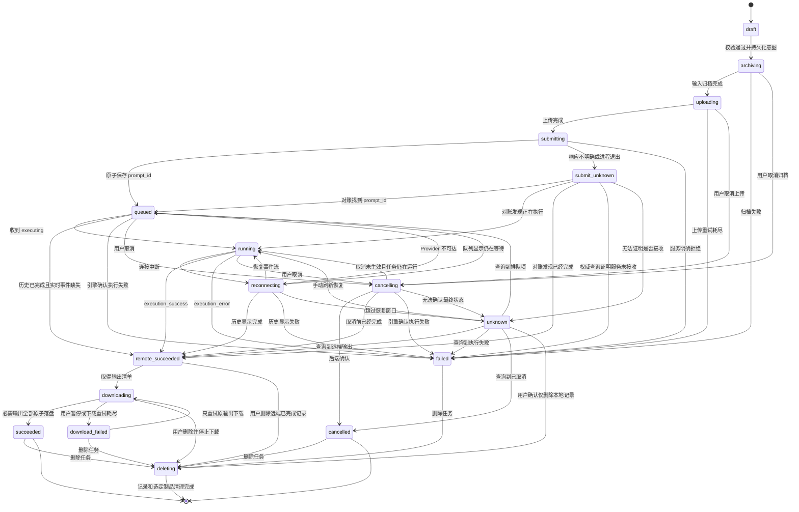
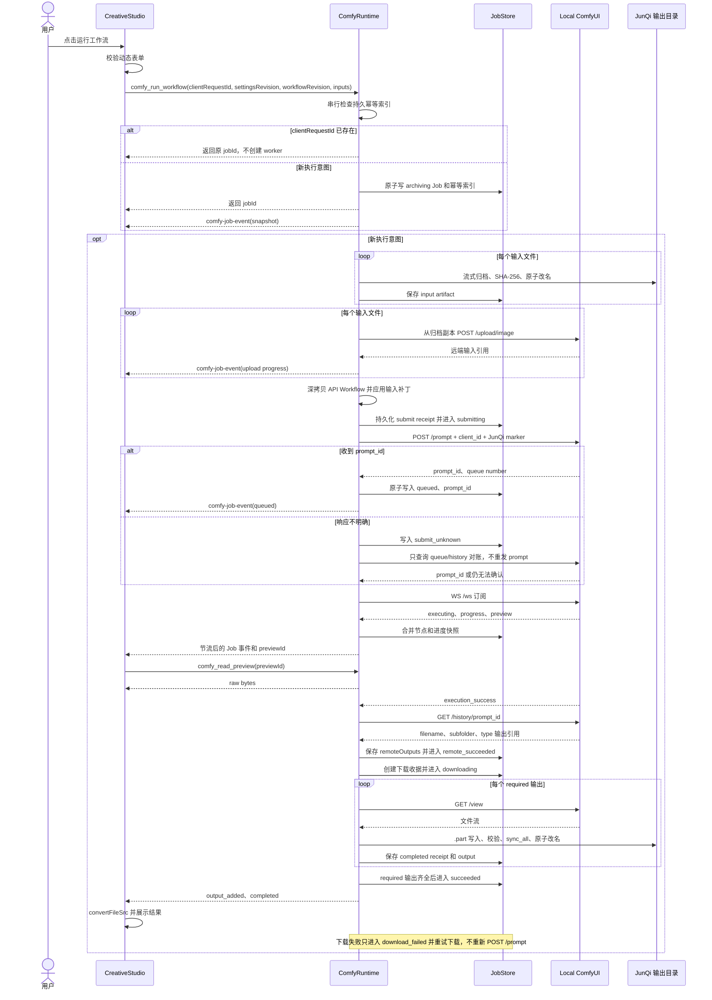
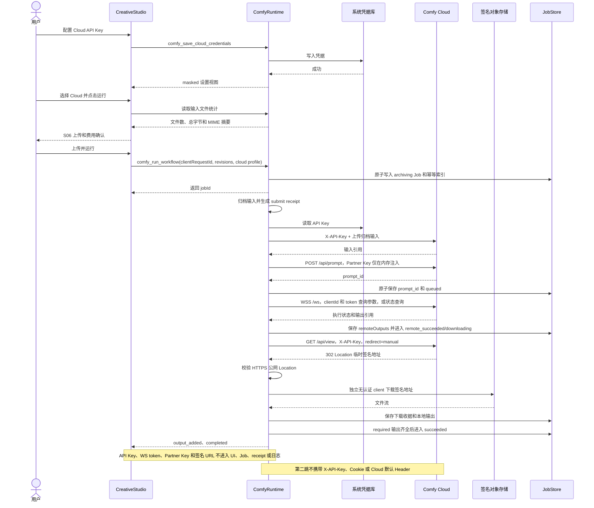
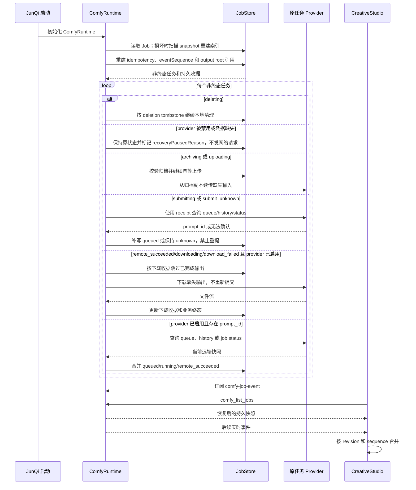
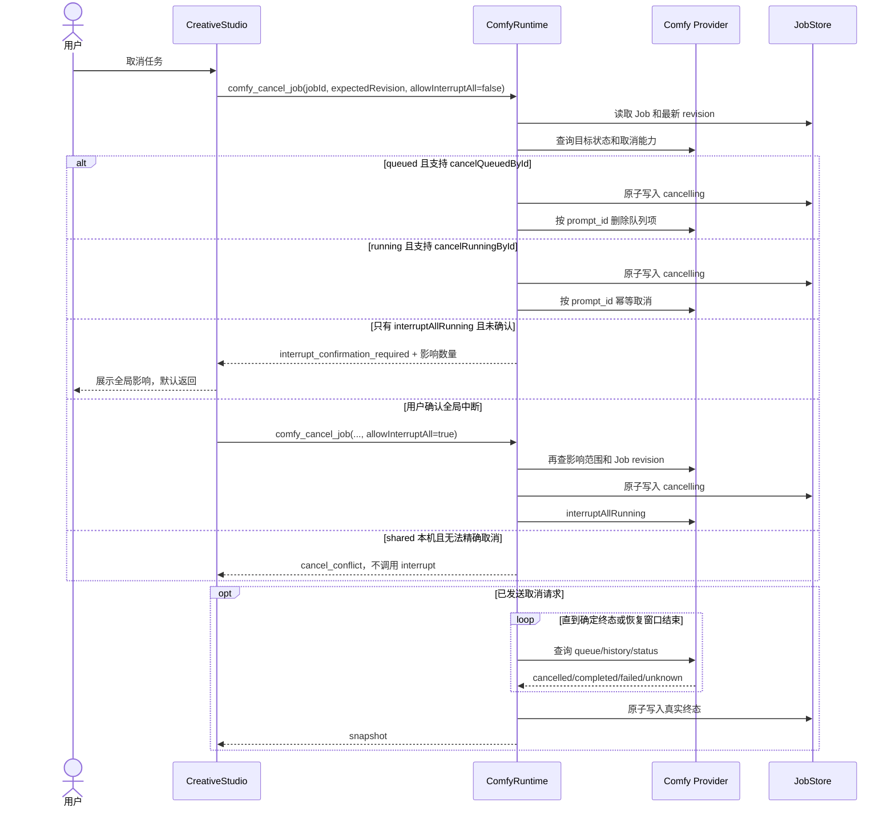

# ComfyUI 创作工作台详细设计

## 文档信息

| 项目     | 内容                                                                                         |
| -------- | -------------------------------------------------------------------------------------------- |
| 状态     | 闭环修订稿，待实施与验证                                                                     |
| 设计分支 | `feat/comfyui-creative-studio-design`，提交前必须确认当前分支，禁止把设计提交直接落到 `main` |
| 日期     | 2026-07-17                                                                                   |
| 平台     | Windows、macOS                                                                               |
| 主入口   | `工作台 > 创作`                                                                              |
| 主路由   | `/create`                                                                                    |
| 配置入口 | `/settings?tab=creation`                                                                     |

阅读顺序：

- 产品和交互负责人：第 1-7、22-25、34 节。
- 前端负责人：第 5-9、13-16、22-28、31-34 节。
- Rust 负责人：第 8-12、22、26-32 节。
- 测试和发布负责人：第 17-20、29-34 节。

## 1. 设计结论

JunQi 提供产品级创作工作台，ComfyUI 作为独立执行引擎存在。普通用户不需要理解节点图，高级用户可以从 JunQi 打开原生 ComfyUI 编辑器。

首版采用以下边界：

- 导航名称使用「创作」，不使用「ComfyUI」。
- 默认连接用户已经安装并启动的本机 ComfyUI。
- 支持 Comfy Cloud，但必须由用户显式配置和选择。
- 本机失败时禁止自动切换云端，防止隐私数据和费用失控。
- JunQi 安装包不包含 ComfyUI、Python、PyTorch、模型或 Custom Nodes。
- 不提供节点画布，不复制 ComfyUI 前端。
- 不在 `/tools` 中承载创作界面。该页面继续负责工具调用监控。
- 所有 ComfyUI HTTP、WebSocket 和密钥操作收敛到 Rust 后端。

### 1.1 业务闭环不变量

以下规则优先级高于具体 UI 和接口实现，任何 Provider 都不得绕过：

1. **一次执行意图只有一个本地 Job**：`clientRequestId`、Job 和提交尝试必须持久关联，HTTP 结果不明确时禁止盲目重提。
2. **远端执行与本地制品分阶段完成**：远端生成成功不等于业务完成；所有必需输出完成下载、校验和原子落盘后才能进入 `succeeded`。
3. **取消按能力降级**：精确取消、删除排队项和中断全部运行项是三种不同能力；不能用一次队列查询掩盖全局 interrupt 的竞态。
4. **历史可复现**：Job 引用的工作流 revision 和输入归档不可被后续替换、移动或删除反向改变。
5. **持久快照是真相**：WebSocket 只改善实时体验，恢复必须依赖持久 Job、`prompt_id`、Provider 查询和下载收据。
6. **制品生命周期可恢复**：下载、目录切换、保留期清理和手动删除都必须有中间状态，崩溃后能继续或回滚。
7. **敏感数据只在最小边界存在**：Cloud API Key、WebSocket token、Partner Node Key 和签名 URL 不进入前端、Job、日志或诊断。
8. **功能可用不依赖外网**：未显式选择 Cloud 时，不得因为探测、恢复、更新或失败回退产生境外请求。

## 2. 产品目标

### 2.1 目标

1. 用户能在 JunQi 中选择工作流、填写参数、执行任务并取得结果。
2. 图片、视频、音频等输出具有统一的预览、保存和回流聊天能力。
3. 本机与云端使用同一套创作界面，来源和费用语义始终清晰。
4. 任务执行期间能看到排队、当前节点、步骤进度、实时预览和日志。
5. 应用重启、提交响应丢失或 WebSocket 中断后，可以根据持久提交记录和 `prompt_id` 恢复或明确进入待人工确认状态。
6. 国内网络不可用时，本机创作仍可正常使用，应用不得主动访问境外服务。

### 2.2 非目标

- 不在首版安装或升级 ComfyUI。
- 不在首版下载模型或 Custom Nodes。
- 不解析和复刻完整节点编辑器。
- 不保证任意第三方工作流导入后无需配置即可运行。
- 不把 Comfy Cloud 作为本机服务的自动容灾节点。
- 不把生成任务强制绑定到 OpenClaw 会话。

## 3. 术语与用户语义

| 产品术语 | 技术含义                                     | UI 展示原则                            |
| -------- | -------------------------------------------- | -------------------------------------- |
| 创作     | JunQi 的媒体生成工作台                       | 主导航名称                             |
| 创作引擎 | ComfyUI 本机或 Comfy Cloud                   | 只在设置和状态区域出现                 |
| 本机     | 用户设备上的 ComfyUI 服务                    | 默认来源，显示「数据不离开本机」       |
| 云端     | Comfy Cloud                                  | 显示上传和费用提示                     |
| 工作流   | 可执行的 Workflow API JSON 加 JunQi 输入描述 | 普通用户看到模板名称和参数             |
| 任务     | 一次工作流执行                               | 对应一个本地任务 ID 和远端 `prompt_id` |
| 结果     | 图片、视频、音频或其他输出文件               | 可预览、保存、回流聊天                 |
| 远端完成 | ComfyUI 已执行成功并产生输出引用             | 仍需下载，不展示为最终成功             |
| 业务完成 | 必需输出已校验并保存到 JunQi 管理目录        | 展示为成功                             |

## 4. 信息架构与入口

### 4.1 一级入口

在左侧导航「工作台」分组中增加「创作」，顺序放在「AI 工作台」之后、「终端」之前。

```text
工作台
  工作空间
  AI 工作台
  创作
  终端
  文件管理
  MCP 工具
  ...
```

推荐图标使用项目现有 Lucide 图标族的 `Image`。路由为 `/create`，功能开关为新增的 `creativeStudio`。

入口必须同时注册到：

- `AppRouteTree`
- `EditionFeatureKey`、默认功能配置和路由映射
- 左侧工作台导航
- 命令面板
- 页面标题和返回路径识别

### 4.2 配置入口

设置页新增「创作引擎」标签，路由为 `/settings?tab=creation`。

设置页只负责：

- 本机服务地址和连接检测
- 云端密钥和连接检测
- 默认执行位置
- 输出目录
- 隐私与远程地址策略
- 诊断信息和日志入口

设置页不负责选择工作流和运行任务。

### 4.3 聊天快捷入口

在聊天输入区增加 `ImagePlus` 图标按钮，名称为「生成媒体」。

- 桌面宽度充足时直接展示在附件与截图按钮附近。
- 窄窗口时收进统一的加号操作菜单，避免压缩输入框。
- 点击后打开轻量创作抽屉，而不是在聊天中嵌入完整三栏工作台。
- 抽屉只保留引擎、工作流、主要输入和运行按钮。
- 复杂设置通过「打开创作工作台」进入 `/create`。
- 成功结果可以插入当前会话附件，也可以只保留在创作历史中。

### 4.4 次级入口

- Dashboard 快捷动作「生成媒体」跳转 `/create`。
- 生成结果中的「发送到对话」跳转 `/chat` 并写入当前草稿附件。
- `/tools` 仅展示 `comfy_run_workflow` 等工具的调用统计和结果，不展示连接配置。

## 5. 主页面布局

设计定位为操作型桌面工作台：中高密度、低装饰、克制动效。保持现有 Aegis 主题变量、字号、边框和焦点样式，不引入新的设计系统。

设计参数：

- `DESIGN_VARIANCE: 4`
- `MOTION_INTENSITY: 3`
- `VISUAL_DENSITY: 7`

### 5.1 桌面布局

```text
┌──────────────────────────────────────────────────────────────────────────────┐
│ 创作   [本机 | 云端]  ● 已连接   当前工作流：产品图生成   队列 2   [运行] │
├────────────────┬──────────────────────────────────┬──────────────────────────┤
│ 工作流 232px   │ 参数编辑 minmax(420px, 1fr)     │ 任务检查器 312px         │
│                │                                  │                          │
│ 搜索           │ 提示词                           │ 当前状态：执行中 46%     │
│ 常用           │ 反向提示词                       │ 当前节点：KSampler       │
│ 图片生成       │ 输入图片                         │ 实时预览                 │
│ 图片编辑       │ 尺寸、步数、Seed                 │ 节点日志                 │
│ 视频           │ 工作流扩展参数                   │ 取消 / 重试              │
│ 音频           │                                  │                          │
│ 自定义         │                                  │                          │
├────────────────┴──────────────────────────────────┴──────────────────────────┤
│ 结果栏：缩略图  预览  保存  发送到对话  作为输入  打开所在位置             │
└──────────────────────────────────────────────────────────────────────────────┘
```

布局使用稳定网格尺寸：

- 顶部工具栏高度 48px。
- 工作流栏宽度 232px，可在 208-300px 之间调整。
- 任务检查器宽度 312px，可在 280-380px 之间调整。
- 结果栏默认高度 168px，可收起，可在 128-320px 之间调整。
- 分栏调整只改变网格轨道，不允许内容把布局撑开。
- 面板之间使用分隔线，不使用卡片套卡片。

### 5.2 顶部工具栏

从左到右：

1. 页面名称「创作」。
2. 引擎分段控制 `本机 | 云端`。
3. 真实连接状态，包括已连接、连接中、不可用和需要配置。
4. 当前工作流选择器。
5. 队列数量入口。
6. 主操作「运行工作流」。

规则：

- 切换本机和云端是显式用户操作。
- 任务运行中切换引擎不迁移当前任务，只改变下一次执行目标。
- 未连接时运行按钮禁用，并在按钮附近提供「配置」命令。
- 云端首次运行前必须确认上传和费用，不把确认藏在设置页。

### 5.3 工作流栏

工作流栏使用紧凑列表，不使用大卡片瀑布流。

分组：

- 常用
- 图片生成
- 图片编辑
- 视频
- 音频
- 自定义
- 最近使用

每行显示媒体类型图标、名称和兼容性状态。只有真实异常才出现状态标记，例如缺少节点、缺少模型或当前引擎不支持。

顶部操作：

- 搜索
- 导入工作流
- 新建工作流映射
- 打开工作流目录

右键或更多菜单：

- 重命名
- 编辑参数映射
- 导出 JunQi 工作流包
- 在 ComfyUI 中编辑
- 删除

### 5.4 参数编辑区

参数表单由工作流清单驱动，不直接暴露节点 ID。

字段类型：

- 单行文本
- 多行提示词
- 数值输入和步进器
- 滑块加精确数值输入
- 下拉选择
- 布尔开关
- 图片、视频、音频和文件输入
- 尺寸预设和自定义宽高
- Seed 输入，支持随机锁定
- 模型、采样器和调度器选择

字段规则：

- 标签在输入框上方，禁止只用 placeholder 充当标签。
- 首屏只展示主要参数，高级参数放入可展开分组。
- 表单变更只修改任务草稿，不修改原始工作流模板。
- 每个字段可恢复模板默认值。
- 缺少模型或节点时在对应字段附近显示可操作错误。

### 5.5 任务检查器

任务检查器承载当前任务，不与历史结果混合。

展示内容：

- 任务状态
- 当前引擎
- 排队位置
- 总进度
- 当前节点名称
- 节点步骤，例如 `12 / 30`
- 实时预览
- 开始时间和已用时间
- 可折叠日志
- 取消、重试和复制诊断信息

进度来源：

- `progress` 消息提供确定性步骤进度。
- `executing` 消息提供当前节点。
- 二进制 WebSocket 消息提供实时预览。
- 没有确定进度时使用阶段状态，不伪造百分比。

### 5.6 结果栏

结果栏按任务分组显示缩略图，支持图片、视频、音频和普通文件。

单个结果操作：

- 预览
- 保存副本
- 发送到对话
- 作为当前工作流输入
- 打开所在位置
- 复制文件路径

图片预览复用现有 `ChatImage` 的缩放、旋转和保存能力。视频复用 `ChatVideo`。不再建设第二套媒体查看器。

## 6. 页面状态设计

### 6.1 首次进入

页面保留完整工作台骨架，在参数区显示连接状态，不使用营销式空白页。

提供两个明确操作：

- 「连接本机 ComfyUI」
- 「配置云端」

本机是首要操作。页面加载时只探测已配置的本机回环地址，不访问 Comfy Cloud。

### 6.2 加载状态

- 工作流列表使用与最终列表同尺寸的骨架行。
- 参数区使用稳定字段骨架。
- 任务检查器保留固定宽度。
- 禁止用全屏旋转图标替代整个页面。

### 6.3 空状态

| 场景       | 主文案                 | 操作               |
| ---------- | ---------------------- | ------------------ |
| 未配置引擎 | 尚未连接创作引擎       | 连接本机、配置云端 |
| 没有工作流 | 还没有可运行的工作流   | 导入 API 工作流    |
| 没有任务   | 运行后可在这里查看进度 | 无额外按钮         |
| 没有结果   | 当前任务尚未产生输出   | 无额外按钮         |

### 6.4 错误状态

错误必须包含以下信息：

- 用户能理解的错误标题
- 引擎和任务 ID
- 节点 ID 与节点名称（存在时）
- 原始错误摘要
- 推荐动作
- 复制诊断信息

典型动作：

- 重新连接
- 重试任务
- 打开 ComfyUI
- 编辑工作流映射
- 打开设置

禁止只显示「执行失败」或只弹出瞬时 Toast。

## 7. 核心用户流程

### 7.1 连接本机 ComfyUI

```text
进入创作
  -> JunQi 探测已保存的回环地址
  -> GET /system_stats 和 GET /object_info
  -> 成功：显示版本、设备和可用节点
  -> 失败：保留地址并展示诊断，不自动切云
  -> 用户可进入设置修改地址并再次检测
```

默认地址为 `http://127.0.0.1:8188`。首版不自动启动、不自动安装 ComfyUI。

### 7.2 配置 Comfy Cloud

```text
设置 > 创作引擎 > 云端
  -> 输入 API Key
  -> Rust 后端写入系统凭据库
  -> 调用 Cloud API 验证
  -> 前端只接收 masked key 和验证结果
  -> 保存后返回创作页
  -> 第一次运行再次确认数据上传和可能产生费用
```

Cloud API 是实验性接口。云端适配器必须隔离，不能让 Cloud 路径和字段泄漏到统一领域模型中。

### 7.3 导入工作流

```text
导入 JSON
  -> 判断是否为 API Format Workflow
  -> 校验节点和输入结构
  -> 查询 /object_info 验证节点兼容性
  -> 自动识别常见文本、Seed、尺寸和文件输入
  -> 无法确定的输入进入映射步骤
  -> 保存 JunQi 工作流清单
  -> 生成参数表单预览
```

导入原始前端工作流 JSON 时，提示用户先在 ComfyUI 中导出 API 格式。不要通过脆弱的字段猜测强行转换完整画布 JSON。

### 7.4 运行任务

```text
选择工作流
  -> 填写参数
  -> 前端校验必填项
  -> Rust 校验文件、地址、引擎和工作流补丁
  -> 持久化 Job、提交意图并归档输入
  -> 上传输入文件
  -> 复制模板并应用节点输入补丁
  -> POST /prompt 或 POST /api/prompt
  -> 原子保存 prompt_id；响应不明确时进入 submit_unknown 并对账
  -> WebSocket 订阅执行事件
  -> 更新队列、节点、进度和预览
  -> 远端执行成功后进入 remote_succeeded
  -> 获取历史与完整输出引用
  -> 流式下载、校验并原子写入 JunQi 输出目录
  -> 所有必需输出落盘后进入 succeeded
```

### 7.5 发送结果到聊天

```text
结果栏选择「发送到对话」
  -> 选择当前会话或新会话
  -> 通过 outputId 校验结果仍位于受管目录
  -> 将本地结果路径写入目标会话 draftAttachments
  -> Gateway 在线：跳转 /chat
  -> Gateway 离线：留在创作页并显示「已加入草稿，连接后发送」
  -> 用户确认并发送
```

该动作只加入草稿，不自动向模型发送内容。没有可用目标会话时，保存只含 `outputId` 的待回流记录，Gateway 恢复并由用户选择会话后再解析本地路径；不得把任意前端路径写入聊天附件。Gateway 离线时不主动跳到会被 OfflineOverlay 覆盖的 `/chat`。

### 7.6 在 ComfyUI 中编辑

- 本机：通过系统浏览器或独立 WebView 打开本机 ComfyUI 地址。
- 云端：打开官方 Cloud 编辑入口。
- 不在 JunQi 页面中使用 iframe 嵌套节点画布。
- 从 JunQi 打开前保存当前参数草稿，返回后允许重新载入工作流。

### 7.7 断线恢复

```text
WebSocket 中断
  -> 任务进入 reconnecting，不立即判定失败
  -> 1s、2s、4s、8s、15s 退避重连
  -> 同时按引擎能力轮询任务状态
  -> 找到任务：恢复进度或结果
  -> 明确失败：进入 failed
  -> 超过恢复窗口：进入 unknown，并提供手动刷新
```

应用重启后读取未终结任务。已有 `prompt_id` 的任务按原 Provider 恢复；提交结果不明确且没有 `prompt_id` 的任务进入 `submit_unknown` 对账，绝不自动重新提交。

## 8. 工作流包设计

ComfyUI API JSON 本身不包含适合产品表单的完整名称、排序和说明。JunQi 需要一层轻量清单，不修改原始工作流语义。

建议格式：

```json
{
  "schemaVersion": 1,
  "id": "product-image-basic",
  "name": "产品图生成",
  "description": "根据产品图片和提示词生成展示图",
  "mediaType": "image",
  "workflow": {},
  "inputs": [
    {
      "id": "prompt",
      "label": "提示词",
      "type": "text_area",
      "required": true,
      "target": { "nodeId": "6", "input": "text" }
    },
    {
      "id": "seed",
      "label": "Seed",
      "type": "seed",
      "target": { "nodeId": "3", "input": "seed" }
    }
  ],
  "outputs": [
    {
      "id": "primary-image",
      "nodeId": "9",
      "kind": "image",
      "primary": true,
      "required": true
    }
  ],
  "requirements": {
    "nodes": [],
    "models": []
  }
}
```

规则：

- `workflow` 保存 API Format Workflow。
- 执行时深拷贝 `workflow`，再应用 `inputs.target` 补丁。
- 节点 ID 和字段名只存在于映射层，不暴露在普通表单中。
- 清单升级必须有 `schemaVersion` 和迁移函数。
- 不执行工作流内携带的脚本，不自动安装依赖。

## 9. 前端领域模型

```ts
type ComfyProviderKind = "local" | "cloud";

type ComfyConnectionState =
  "unconfigured" | "checking" | "ready" | "degraded" | "unreachable";

type ComfyJobStatus =
  | "draft"
  | "archiving"
  | "uploading"
  | "submitting"
  | "submit_unknown"
  | "queued"
  | "running"
  | "reconnecting"
  | "remote_succeeded"
  | "downloading"
  | "download_failed"
  | "succeeded"
  | "failed"
  | "cancelling"
  | "cancelled"
  | "unknown"
  | "deleting";

interface ComfyJob {
  id: string;
  providerId: string;
  workflowId: string;
  promptId?: string;
  status: ComfyJobStatus;
  queuePosition?: number;
  currentNodeId?: string;
  currentNodeName?: string;
  progress?: { value: number; max: number };
  outputs: ComfyOutput[];
  error?: ComfyJobError;
  createdAt: string;
  updatedAt: string;
}
```

Store 分层：

- `creativeStudioStore`：当前引擎、工作流、草稿参数和面板状态。
- `comfyJobsStore`：任务队列、状态迁移、恢复和结果索引。
- 密钥、网络客户端和持久任务真相不放在 Zustand 中。
- 高频 WebSocket 预览不进入全局 React 状态，使用有界缓存和节流更新。

## 10. 后端架构

### 10.1 统一能力接口

```rust
trait ComfyProvider {
    async fn probe(&self) -> Result<ProviderStatus, ComfyError>;
    async fn capabilities(&self) -> Result<ProviderCapabilities, ComfyError>;
    async fn object_info(&self) -> Result<ObjectInfo, ComfyError>;
    async fn upload_input(&self, input: UploadInput) -> Result<UploadedInput, ComfyError>;
    async fn enqueue(&self, request: EnqueueRequest) -> Result<SubmitOutcome, ComfyError>;
    async fn reconcile_submission(&self, receipt: SubmitReceipt) -> Result<ReconcileOutcome, ComfyError>;
    async fn job_status(&self, prompt_id: &str) -> Result<JobSnapshot, ComfyError>;
    async fn cancel(&self, request: CancelRequest) -> Result<CancelOutcome, ComfyError>;
    async fn fetch_output(&self, output: OutputRef) -> Result<LocalOutput, ComfyError>;
}
```

实现：

- `LocalComfyProvider`
- `ComfyCloudProvider`

Provider 适配器负责路径、鉴权和响应差异。UI 只消费统一状态。

### 10.2 Tauri 命令

建议命令：

- `comfy_get_settings`
- `comfy_save_local_settings`
- `comfy_save_cloud_credentials`
- `comfy_delete_cloud_credentials`
- `comfy_test_connection`
- `comfy_list_workflows`
- `comfy_import_workflow`
- `comfy_save_workflow_manifest`
- `comfy_run_workflow`
- `comfy_get_job`
- `comfy_list_jobs`
- `comfy_cancel_job`
- `comfy_retry_job`
- `comfy_reveal_output`
- `comfy_open_editor`

统一事件：`comfy-job-event`。

```ts
type ComfyJobEvent =
  | { type: "snapshot"; jobId: string }
  | {
      type: "archiving";
      jobId: string;
      completedBytes: number;
      totalBytes: number;
    }
  | {
      type: "uploading";
      jobId: string;
      completedBytes: number;
      totalBytes: number;
    }
  | { type: "submitting"; jobId: string }
  | { type: "submission_unknown"; jobId: string }
  | { type: "queued"; jobId: string; queuePosition?: number }
  | { type: "executing"; jobId: string; nodeId?: string; nodeName?: string }
  | { type: "progress"; jobId: string; value: number; max: number }
  | { type: "preview"; jobId: string; previewId: string }
  | { type: "remote_completed"; jobId: string; outputCount: number }
  | {
      type: "downloading";
      jobId: string;
      completedBytes: number;
      totalBytes?: number;
    }
  | { type: "output"; jobId: string; output: ComfyOutput }
  | { type: "download_failed"; jobId: string; error: ComfyJobError }
  | { type: "completed"; jobId: string }
  | { type: "failed"; jobId: string; error: ComfyJobError }
  | { type: "reconnecting"; jobId: string; attempt: number }
  | { type: "cancelling" | "cancelled" | "deleting"; jobId: string };
```

### 10.3 本机 API 映射

| 能力         | ComfyUI API                                              |
| ------------ | -------------------------------------------------------- |
| 服务探测     | `GET /system_stats`                                      |
| 节点能力     | `GET /object_info`                                       |
| 上传输入     | `POST /upload/image`                                     |
| 提交任务     | `POST /prompt`                                           |
| 实时事件     | `WS /ws`                                                 |
| 队列         | `GET /queue`                                             |
| 删除排队任务 | `POST /queue`                                            |
| 历史         | `GET /history/{prompt_id}`                               |
| 输出         | `GET /view`                                              |
| 精确取消任务 | `POST /api/jobs/{job_id}/cancel`，仅在能力探测确认后使用 |
| 旧版全局中断 | `POST /interrupt`，只允许独占实例并显式确认              |

### 10.4 云端 API 映射

| 能力                     | Comfy Cloud API                   |
| ------------------------ | --------------------------------- |
| 节点能力                 | `GET /api/object_info`            |
| 上传输入                 | `POST /api/upload/image`          |
| 提交任务                 | `POST /api/prompt`                |
| 实时事件                 | `WSS /ws`                         |
| 任务状态                 | `GET /api/job/{prompt_id}/status` |
| 输出                     | `GET /api/view`                   |
| 删除排队任务             | `POST /api/queue`                 |
| 中断当前账号全部运行任务 | `POST /api/interrupt`             |

Cloud REST 适配器集中添加 `X-API-Key`。Cloud WebSocket 按官方协议使用查询参数 `token`，但完整 URL 和 token 不得进入日志。Cloud 输出下载必须禁用自动重定向：第一跳携带 `X-API-Key` 并读取 302 `Location`，第二跳使用独立的无认证客户端，严禁转发 `X-API-Key`。

取消语义必须由后端统一处理：

- `cancelQueuedById`：排队任务使用队列删除并携带目标 `prompt_id`。
- `cancelRunningById`：能力探测确认后，优先使用按 Job ID 的幂等取消接口。
- `interruptAllRunning`：旧版本地接口和 Cloud interrupt 属于全局副作用能力，不能标记为精确取消。
- 本机 Provider 默认 `shared`。`shared` 且不支持精确取消时，运行中任务返回 `cancel_conflict`，不得调用旧版 interrupt。
- 只有用户把本机 Provider 明确设为 `exclusive`，后端重新读取当前项并再次确认影响范围后，才允许使用旧版 interrupt；队列查询仍不能消除竞态，因此 UI 必须使用「中断此引擎当前任务」语义。
- Cloud 存在多个运行任务时，必须展示将影响的任务数量并取得本次操作确认；没有确认不得调用 `/api/interrupt`。
- 取消请求返回后继续查询队列或任务状态，只有引擎确认后才进入 `cancelled`。
- 如果取消和完成同时发生，以查询到的最终历史与输出为准，允许 `cancelling -> remote_succeeded`。

### 10.5 持久化

建议目录：

```text
paths::app_config_dir()/creative-studio/
    settings.json
    workflows/
      <workflow-id>/
        current.json
        revisions/
          <revision>/
            manifest.json
            workflow.json
    output-roots.json

paths::app_data_dir()/creative-studio/
    jobs/
      index.json
      <job-id>/
        snapshot.json
        inputs/
        submit-receipt.json
        downloads.json
    idempotency.json
    imports/
      <import-token>/
        candidate.json
        metadata.json
    previews/

resolved_output_dir/
  YYYY-MM/
    <job-id>/
```

- `settings.json` 不保存明文密钥。
- 密钥使用系统凭据库，账户 ID 使用 `comfy-cloud:<profile-id>`。
- workflow revision 创建后不可覆盖；`current.json` 只保存当前 revision 指针。
- Job、任务索引、提交收据和幂等索引采用临时文件、`sync_all`、原子改名；索引损坏时可从各 Job snapshot 重建。
- 输入在提交前归档到 Job 的 `inputs/`，记录原始显示名、大小、MIME、SHA-256 和归档相对路径，不依赖原始绝对路径完成重试。
- 临时导入目录记录 `createdAt`，保存或取消后立即删除，异常退出残留在下次启动按 24 小时 TTL 清理。
- 预览帧为临时缓存，不长期持久化。
- 输出按任务隔离，文件名必须净化并防止路径穿越。
- `output-roots.json` 为每个 JunQi 管理输出根分配 `rootId` 并记录引用；修改默认目录不会撤销仍被历史输出引用的 scope。

## 11. 安全与隐私

### 11.1 网络策略

- 默认本机地址只允许 `127.0.0.1`、`localhost` 和 `::1`。
- 自定义局域网地址需要用户显式开启「允许远程 ComfyUI」。
- 非回环 HTTP 地址展示明文传输警告。
- 应用启动和进入创作页时不得探测 Comfy Cloud。
- 只有用户选择云端并保存配置后，才允许访问 `cloud.comfy.org`。
- 本机失败不得触发任何境外请求。

### 11.2 密钥策略

- API Key 只在 Rust 后端和系统凭据库中出现。
- 前端只获取 masked 值和连接状态。
- Cloud REST API Key 只放在 `X-API-Key`。Cloud WebSocket 官方协议要求 `token` 查询参数，这是唯一受控例外；构造、连接和重连都在 Rust 内完成。
- Partner Nodes 所需 `extra_data.api_key_comfy_org` 只在发送前从凭据库注入内存请求，不能进入工作流 revision、Job、提交收据或错误详情。
- 日志过滤 `X-API-Key`、`token` 查询参数、Partner Node Key 和签名下载地址。
- 诊断复制内容不得包含提示词、文件内容和密钥。

### 11.3 工作流风险

- Custom Nodes 可以执行任意 Python 代码，JunQi 不自动安装、启用或更新。
- 工作流导入只处理 JSON 数据，不执行其中的脚本或命令。
- 缺少节点时提供名称和诊断，不提供一键静默安装。
- 打开远程 ComfyUI 前显示数据边界和地址。

### 11.4 上传策略

- 云端执行前明确列出将上传的文件数量和总大小。
- 首次云端执行必须确认，之后允许用户选择每次询问。
- 支持配置单文件和单任务大小上限。
- 上传失败支持幂等重试，不重复提交工作流任务。

## 12. 任务状态机



状态迁移由后端使用 revision 比较和合法迁移表确认，前端按钮点击不能直接把任务标记为已取消或成功。`failed`、`cancelled` 和 `succeeded` 的「再次运行」始终创建新 Job；只有 `download_failed` 在原 Job 上重试下载，绝不重新提交工作流。

## 13. 响应式与窗口行为

JunQi 是桌面应用，但必须支持窄窗口。

| 内容宽度      | 布局                                         |
| ------------- | -------------------------------------------- |
| `>= 1280px`   | 三栏加底部结果栏                             |
| `1024-1279px` | 工作流栏变抽屉，参数区加任务检查器           |
| `760-1023px`  | 参数、任务、结果使用顶部页签，工作流使用抽屉 |
| `< 760px`     | 单栏模式，顶部工具栏折叠次要操作             |

规则：

- 工具栏文本不得换行。
- 运行按钮和引擎来源始终可见。
- 抽屉打开时焦点被约束，关闭后归还触发按钮。
- 面板尺寸使用 CSS Grid 轨道和最小值，禁止按百分比硬算。
- 动态内容不得改变工具栏、按钮和结果缩略图的稳定尺寸。

## 14. 可访问性与交互细节

- 所有图标按钮提供 tooltip 和 `aria-label`。
- 引擎选择使用真正的单选或分段控制语义。
- 进度使用 `role="progressbar"`，未知进度不填写虚假 `aria-valuenow`。
- 状态更新通过节流的 `aria-live="polite"` 区域播报，避免每个采样步骤都打断读屏。
- 错误与字段通过 `aria-describedby` 关联。
- 所有操作支持键盘访问，焦点样式复用现有 Aegis focus ring。
- 动效只用于面板展开、任务状态和操作反馈，并尊重 reduced motion。
- 颜色不是状态的唯一表达方式，必须同时提供图标或文字。
- `Ctrl/Cmd + Enter` 运行，`Esc` 关闭浮层，快捷键不作为页面常驻说明文字。

## 15. 日志与诊断

日志分三层：

1. 用户日志：连接、上传、排队、节点、下载和失败摘要。
2. 诊断日志：请求耗时、状态码、重连次数和任务 ID。
3. 调试日志：只在显式调试模式启用，不记录请求体、提示词和密钥。

任务检查器只显示当前任务日志。完整日志进入现有日志页，并支持按 `comfy` 类别和任务 ID 过滤。

## 16. 组件与文件规划

### 16.1 前端

```text
src/pages/CreativeStudio/
  index.tsx
  components/
    CreativeToolbar.tsx
    WorkflowLibrary.tsx
    WorkflowImportDialog.tsx
    WorkflowParameterEditor.tsx
    JobInspector.tsx
    ResultTray.tsx
    MediaPreviewDialog.tsx
  hooks/
    useComfyJobEvents.ts
    useWorkflowDraft.ts

src/components/settings/
  CreativeEngineSettingsPanel.tsx

src/components/Chat/
  CreativeQuickDrawer.tsx

src/stores/
  creativeStudioStore.ts
  comfyJobsStore.ts

src/services/comfy/
  api.ts
  types.ts
  workflowManifest.ts
```

需要修改：

- `src/AppRouteTree.tsx`
- `src/config/edition.ts`
- `src/components/Layout/NavSidebarPanels.tsx`
- `src/components/Layout/NavSidebar.tsx`
- `src/components/CommandPalette.tsx`
- `src/pages/SettingsPage.tsx`
- `src/components/Chat/MessageInput.tsx`
- 中文和英文 i18n 资源

### 16.2 Rust

```text
src-tauri/src/commands/comfy/
  mod.rs
  types.rs
  settings.rs
  workflow.rs
  job_store.rs
  client.rs
  local.rs
  cloud.rs
  events.rs
  security.rs
```

需要修改：

- `src-tauri/src/commands/mod.rs`
- `src-tauri/src/lib.rs`
- `src-tauri/Cargo.toml`，增加直接 WebSocket 客户端依赖和实际使用的 stream trait 依赖

原则：网络层、任务恢复、输出下载和密钥完全在 Rust 侧。React 不直接请求 ComfyUI。

## 17. 实施阶段

### 17.1 导航与领域骨架

交付：

- `creativeStudio` 功能开关
- `/create` 路由和左侧入口
- 设置页「创作引擎」标签
- Provider、Job、Workflow 类型
- 后端设置和连接检测命令
- 未配置、连接中、可用和失败状态

验收：

- 打开应用不会访问 Comfy Cloud。
- 本机 `127.0.0.1:8188` 可被检测。
- 本机失败不会产生任何云端请求。
- main 和 daxia 可通过独立功能配置控制入口。

### 17.2 本机工作流 MVP

交付：

- 导入 API Workflow JSON
- 输入映射和工作流清单
- 参数表单
- 上传输入
- `/prompt` 提交
- `/ws` 状态订阅
- `/history` 和 `/view` 结果获取
- 输入归档、持久幂等和不确定提交对账
- 能力探测后的精确取消与受限降级

验收：

- 至少完成文本生图和图生图两类真实工作流。
- 当前节点和确定性进度与 ComfyUI 一致。
- 失败时显示节点和错误详情。
- 提交响应丢失时不会自动重提，重启后也只出现一个远端任务。
- shared 实例不支持精确取消时，不会调用全局 interrupt。
- JunQi 安装制品大小不因 ComfyUI 集成明显增加。

### 17.3 结果与聊天闭环

交付：

- 图片、视频和音频结果栏
- 复用现有媒体预览组件
- 保存、打开目录和作为输入
- 发送到聊天草稿
- 聊天轻量创作抽屉
- 任务历史和应用重启恢复
- 远端完成、输出下载和本地完成分阶段展示
- 输出根引用、保留策略和可恢复删除

验收：

- 结果进入聊天前必须由用户确认发送。
- 结果文件丢失时显示可恢复错误，不渲染空白缩略图。
- 下载失败只重试原远端输出，不重新执行工作流。
- 修改默认输出目录后，旧历史结果仍可访问。
- 大量结果使用虚拟化或分页，不能拖慢主界面。

### 17.4 Comfy Cloud

交付：

- 系统凭据库存储 API Key
- Cloud 连接检测
- Cloud Provider 适配器
- 上传确认和费用提示
- Cloud 状态轮询、WebSocket 和输出下载
- Cloud API 兼容性版本测试
- WebSocket token、Partner Node Key 和 302 第二跳凭据隔离

验收：

- API Key 不出现在前端状态、日志和诊断文本。
- Cloud 首次执行有明确确认。
- 切换来源不迁移或重提当前任务。
- Cloud API 字段变化只影响 Cloud 适配器。
- Cloud 下载第二跳请求不携带 `X-API-Key`、Cookie 或 Cloud 默认请求头。
- 多个 Cloud 任务运行时，全局 interrupt 未经影响确认不会发出。

### 17.5 稳定性与发布

交付：

- 断线恢复和重连退避
- 任务索引原子写入
- 持久幂等、提交收据、下载收据和索引重建
- 工作流不可变 revision、输入归档和清理 tombstone
- 文件上限、路径净化和日志脱敏
- Windows、macOS 安装包测试
- 国内断网环境验证
- 性能和可访问性验证

验收：

- 应用重启可恢复未完成任务。
- 在归档、提交、下载和删除的每个阶段强制退出后，都能继续或进入明确可处理状态。
- 关闭外网后本机完整流程不受影响。
- Windows 和 macOS 行为一致，系统凭据库和打开目录使用平台实现。
- 不包含 ComfyUI 离线包、模型和 Python 运行时。

## 18. 测试矩阵

### 18.1 Rust 单元测试

- 地址规范化和回环地址判定
- 非回环地址安全策略
- 工作流节点输入补丁
- 清单版本迁移
- 文件名净化和路径穿越防护
- Cloud 密钥日志脱敏
- Job 状态迁移合法性
- 任务索引损坏恢复
- workflow revision 只创建不可覆盖
- 持久幂等索引重建与重复 clientRequestId
- eventSequence 重启后单调递增
- output root 引用和目录切换
- 清理路径边界与 deleting 恢复
- DNS 多地址、重绑定与 Cloud 302 Location 校验

### 18.2 Rust 集成测试

- Mock ComfyUI 的 `/prompt`、`/history`、`/view` 和 `/ws`
- WebSocket 断开和恢复
- 上传超时和重试
- 提交成功但响应丢失的幂等恢复
- 新版按 ID 取消、旧版 shared 拒绝和 exclusive 全局确认
- Cloud 多任务 interrupt 影响确认
- 取消与远端完成竞态
- Cloud 302 签名输出下载
- 302 第二跳无 Cloud 认证头测试
- 远端成功后下载失败只重试下载
- 输出目录切换后旧结果继续访问
- 删除中崩溃与启动续清理

### 18.3 前端测试

- 功能开关、路由和导航可见性
- 设置标签与 URL 参数同步
- 工作流列表搜索和兼容性状态
- 参数表单类型、默认值和校验
- Job 事件 reducer 的全部状态迁移
- `submit_unknown`、`remote_succeeded`、`download_failed` 和 `deleting` 恢复动作
- 未知进度和确定进度展示
- 错误详情和恢复动作
- 结果发送到聊天草稿
- Gateway 离线时结果留在草稿且不跳转到 OfflineOverlay
- 窄窗口面板折叠行为

### 18.4 端到端测试

| 场景                   | Windows | macOS |
| ---------------------- | ------- | ----- |
| 无外网连接本机 ComfyUI | 必测    | 必测  |
| 文本生图               | 必测    | 必测  |
| 图生图上传             | 必测    | 必测  |
| 任务取消               | 必测    | 必测  |
| 双客户端取消竞态       | 必测    | 必测  |
| 提交响应丢失与重启     | 必测    | 必测  |
| 生成成功后下载失败     | 必测    | 必测  |
| 输出目录切换与历史访问 | 必测    | 必测  |
| 删除中强退与恢复       | 必测    | 必测  |
| ComfyUI 中途退出       | 必测    | 必测  |
| 应用重启恢复           | 必测    | 必测  |
| 云端首次确认           | 必测    | 必测  |
| API Key 脱敏           | 必测    | 必测  |
| 窄窗口布局             | 必测    | 必测  |
| 深色、浅色、护眼主题   | 必测    | 必测  |

## 19. 发布与功能开关

- 首次合入时 `creativeStudio` 可以在 main 默认关闭，在 daxia 按独立产品配置决定是否开启。
- 分支之间只共享通用实现，不把 daxia 的默认值和品牌设置合回 main。
- 功能关闭时路由、导航、命令面板和聊天快捷入口必须同时隐藏。
- 已保存的工作流和任务数据保留，重新启用后可继续使用。
- Cloud 可再使用单独的 `comfyCloud` 能力开关，便于国内发行版完全关闭境外入口。

## 20. 后续边界

可后续评估，但不进入当前实施：

- 按需安装或管理 ComfyUI
- 国内镜像驱动的模型下载
- 工作流市场
- Custom Nodes 管理
- OpenClaw Agent 直接调用创作任务
- 多机局域网 ComfyUI 调度

其中安装、模型和节点分发必须采用按需下载和独立制品，不得重新扩大 JunQi 主安装包。

## 21. 官方接口参考

- [ComfyUI 本机服务路由](https://docs.comfy.org/development/comfyui-server/comms_routes)
- [ComfyUI 当前服务端实现与按任务取消](https://github.com/Comfy-Org/ComfyUI/blob/master/server.py)
- [ComfyUI Workflow 概念](https://docs.comfy.org/development/core-concepts/workflow)
- [Comfy Cloud API 概览](https://docs.comfy.org/development/cloud/overview)
- [Comfy Cloud API 参考](https://docs.comfy.org/development/cloud/api-reference)
- [Comfy Cloud 删除排队任务](https://docs.comfy.org/api-reference/cloud/job/manage-queue-operations)
- [Comfy Cloud 中断当前账号运行任务](https://docs.comfy.org/api-reference/cloud/job/interrupt-currently-running-jobs)

## 22. 当前代码基线与强制接入点

本节记录 2026-07-17 仓库现状。实现时以这里列出的文件为基线，不重新发明平行机制。

### 22.1 App Shell 基线

| 项目             | 当前实现                         | 创作页要求                         |
| ---------------- | -------------------------------- | ---------------------------------- |
| 窗口最小尺寸     | `560 x 420`                      | 必须支持，不允许出现不可关闭的弹窗 |
| 标题栏           | 32px                             | 保持不变                           |
| 顶部标签栏       | 44px                             | 保持不变                           |
| 底部状态栏       | 26px                             | 保持不变                           |
| 展开侧栏         | 204px                            | 保持不变                           |
| 迷你侧栏         | 64px                             | 保持不变                           |
| 路由滚动         | AppLayout 默认 `overflow-y-auto` | `/create` 改为页面内部滚动         |
| Gateway 离线遮罩 | 非可选路由断线 600ms 后显示      | `/create` 必须是 Gateway 可选路由  |

`/create` 与 ComfyUI 直接通信，不依赖 OpenClaw Gateway。实现时必须完成：

1. `AppLayout` 增加 `isCreativeStudioPage`。
2. `/create` 的路由容器使用 `overflow-hidden`，避免外层和面板形成双滚动条。
3. `GATEWAY_OPTIONAL_PATHS` 增加 `/create`。
4. Gateway 离线时创作页照常工作，底部 Gateway 状态栏可以保持离线语义。
5. ComfyUI 离线只影响创作页内部状态，不触发全局 OfflineOverlay。

### 22.2 设计系统基线

创作页复用以下现有变量：

| 用途         | 变量或组件                              |
| ------------ | --------------------------------------- |
| 字号         | `--aegis-fs-2xs` 到 `--aegis-fs-3xl`    |
| 控件高度     | 24、28、32、36、44px                    |
| 圆角         | 3、5、8、12、16px                       |
| 普通交互时长 | 120ms                                   |
| 面板过渡时长 | 180ms                                   |
| 慢速状态过渡 | 260ms                                   |
| 标准缓动     | `--aegis-ease-standard`                 |
| 主按钮       | `Button variant="solid" tone="primary"` |
| 次按钮       | `Button variant="outline"` 或 `soft`    |
| 图标按钮     | `IconButton`                            |
| 表单包装     | `Field`                                 |
| 状态颜色     | Aegis success、warning、danger、primary |
| 焦点         | 现有 Aegis focus ring                   |

新增页面禁止继续手写另一套按钮尺寸、焦点环和状态颜色。创作页卡片圆角默认使用 8px，只有对话框和媒体浮层可使用 12px。工作台主分区使用分隔线，不使用 `GlassCard` 包裹。

### 22.3 现有组件复用边界

| 组件                   | 复用方式                              | 必须补充                                           |
| ---------------------- | ------------------------------------- | -------------------------------------------------- |
| `Button`、`IconButton` | 直接复用                              | 无                                                 |
| `Field`                | 参数表单与设置字段直接复用            | 动态字段要传稳定 id                                |
| `AlertDialog`          | 删除、覆盖和取消确认                  | 云端上传确认需要专用大对话框                       |
| `ChatImage`            | 图片查看与保存逻辑                    | 抽出通用 MediaImage 或增加受控操作回调             |
| `ChatVideo`            | 视频播放和全屏逻辑                    | 传入受限 asset protocol URL，不使用 `aegis-media:` |
| `AudioPlayer`          | 音频结果播放                          | 复核本地文件大小和加载错误状态                     |
| `subscribeTauriEvent`  | 订阅 `comfy-job-event`                | 组件卸载必须执行 unlisten                          |
| 终端侧栏 resize 模式   | 复用 pointer capture 和键盘分隔条语义 | 提取通用 resize helper，避免复制整段事件代码       |

不能直接把 `ChatImage` 和 `ChatVideo` 塞进结果栏后结束。创作结果还需要「发送到对话」「作为输入」「打开所在位置」等操作，因此应建立 `GeneratedMediaItem` 适配层，在适配层内调用现有媒体查看能力。

### 22.4 Rust 基线

当前已有：

- `reqwest 0.12`，具备 HTTP stream 和 JSON 能力。
- `url 2`，用于地址解析和规范化。
- `keyring 3.6.3`，Windows、macOS 和 Linux 已有平台特性配置。
- `paths::app_config_dir()`，用于独立于 OpenClaw 状态目录的稳定配置。
- `paths::atomic_write_text()`，Windows 使用原子替换。
- Tauri `AppHandle.path().app_data_dir()`，用于 Job、输入归档和下载收据；实现时在 comfy 模块封装稳定路径函数。

当前没有直接 WebSocket 客户端依赖。实现阶段应显式增加 `tokio-tungstenite`，并只开启实际需要的 TLS 特性。不得把 WebSocket 退回到前端浏览器连接，否则 Cloud API Key、CORS、断线恢复和任务真相会分散到两个运行时。

### 22.5 数据目录修正

创作元数据属于 JunQi，不属于 OpenClaw。不得放入 `paths::desktop_dir()`，否则用户迁移 OpenClaw 状态目录时会意外搬运大型生成记录。

权威目录：

```text
paths::app_config_dir()/creative-studio/
  settings.json
  workflows/
  output-roots.json

AppHandle.path().app_data_dir()/creative-studio/
  jobs/
  idempotency.json
  imports/

系统图片目录/JunQi/Creative/
  YYYY-MM/
    <job-id>/

系统临时目录/junqi/creative-preview/
  <job-id>/
```

规则：

- 配置、工作流 revision 和输出根注册表进入 `app_config_dir`。
- Job snapshot、输入归档、提交收据、下载收据和幂等索引进入 `app_data_dir`，不与轻量配置混放。
- 完整结果默认进入系统图片目录，用户可以在设置中修改。
- 默认输出根按系统图片目录、下载目录、用户主目录的顺序解析，始终落在用户媒体目录，不回退到配置目录。
- 预览帧只进入系统临时目录。
- OpenClaw 存储迁移不移动创作目录。
- JunQi 卸载时是否删除生成结果由安装器保留数据策略决定，默认不删除用户结果。

## 23. 屏幕与浮层清单

### 23.1 清单

| 编号 | 名称         | 形态           | 入口                          | 退出             |
| ---- | ------------ | -------------- | ----------------------------- | ---------------- |
| S01  | 创作工作台   | 独立路由       | 左侧导航、命令面板、Dashboard | 切换路由         |
| S02  | 创作引擎设置 | 设置页标签     | 设置、未配置提示              | 切换标签或返回   |
| S03  | 连接诊断     | 设置页内展开区 | 连接检测失败                  | 收起或修复成功   |
| S04  | 导入工作流   | 模态对话框     | 工作流栏导入按钮              | 取消或进入映射   |
| S05  | 输入输出映射 | 模态向导       | 导入后自动进入                | 保存或取消       |
| S06  | 云端执行确认 | 模态对话框     | 云端首次执行                  | 确认或取消       |
| S07  | 媒体预览     | 全屏浮层       | 点击结果                      | 关闭、Esc        |
| S08  | 聊天快速创作 | 右侧抽屉       | 聊天输入区 ImagePlus          | 关闭或进入工作台 |
| S09  | 任务历史     | 右侧抽屉       | 工作台队列按钮                | 关闭或选择任务   |

### 23.2 S01 创作工作台

#### 页面根节点

```text
height: 100%
min-height: 0
display: grid
grid-template-rows: 48px minmax(0, 1fr) auto
overflow: hidden
background: var(--aegis-bg)
```

工作台不渲染大标题、欢迎 Hero 或功能介绍。页面名称只在 48px 工具栏中出现。

#### 工具栏尺寸

| 元素         | 高度 | 宽度  | 最小宽度 | 说明               |
| ------------ | ---- | ----- | -------- | ------------------ |
| 工具栏       | 48px | 100%  | 0        | 左右 padding 12px  |
| 页面标题     | 32px | auto  | 52px     | 14px、600 weight   |
| 引擎分段控制 | 32px | 136px | 120px    | 本机、云端两项     |
| 连接状态     | 28px | auto  | 88px     | 图标加文本         |
| 工作流选择   | 32px | 220px | 160px    | 最大 320px         |
| 队列按钮     | 32px | auto  | 32px     | 无任务时不显示数字 |
| 运行按钮     | 32px | 92px  | 80px     | 固定单行           |

工具栏压缩优先级：

1. 先缩短工作流选择器。
2. 再把连接状态收为状态图标，tooltip 保留完整信息。
3. 再把队列文本收为图标和数字。
4. 引擎来源和运行按钮始终保留。
5. 低于 760px 时，工作流选择移到第二行页面页签内，不允许工具栏横向滚动。

#### 主工作区网格

```text
grid-template-columns:
  var(--creative-library-width, 232px)
  minmax(420px, 1fr)
  var(--creative-inspector-width, 312px)
grid-template-rows: minmax(0, 1fr)
```

三列各自拥有独立滚动容器。页面根节点和 AppLayout 路由容器都不能滚动。

#### 工作流栏

| 区域     | 高度     | 行为                       |
| -------- | -------- | -------------------------- |
| 标题区   | 44px     | 标题、导入、更多           |
| 搜索区   | 40px     | 32px 输入框，左右 8px      |
| 类型筛选 | 36px     | 横向图标控制，溢出进入菜单 |
| 列表     | 剩余空间 | 单独纵向滚动               |
| 底部状态 | 28px     | 显示工作流数量和目录异常   |

工作流普通行高 36px，包含错误说明时行高 52px。选中行使用 `primary/10` 背景和左侧 2px 主色指示，不使用整行高饱和背景。

工作流行结构：

```text
[媒体类型图标 16] [名称，可截断] [兼容状态] [更多 28]
```

状态优先级：

1. 工作流 JSON 损坏
2. 缺少节点
3. 缺少模型
4. 当前引擎不支持
5. 可运行

同一行只显示最高优先级状态，完整问题在 tooltip 或详情中列出。

#### 参数编辑区

参数编辑区顶部固定 44px 摘要栏，显示工作流名称、修改状态、恢复默认和打开 ComfyUI。下面是单独滚动的表单。

表单内容宽度：

- 可用宽度小于 720px：单列。
- 可用宽度 720px 及以上：短字段允许两列，提示词和文件字段始终跨两列。
- 表单最大内容宽度 920px，左右 padding 20px。
- 字段组间距 20px，字段间距 14px。

字段建议高度：

| 字段             | 高度                   |
| ---------------- | ---------------------- |
| 单行输入、Select | 32px                   |
| 多行提示词       | 最小 112px，最大 280px |
| 图片输入区       | 最小 148px             |
| 数值加步进       | 32px                   |
| 滑块行           | 40px                   |
| 开关行           | 32px                   |
| 高级参数折叠头   | 36px                   |

表单顶部修改状态只在草稿与模板不一致时出现。切换工作流时按 24.2 的脏草稿决策处理。

#### 任务检查器

任务检查器分为四段：

1. 任务摘要 52px。
2. 预览区，默认 `aspect-ratio: 1 / 1`，最大高度为检查器可用高度的 45%。
3. 进度和当前节点区，最小 92px。
4. 日志区，使用剩余高度并可折叠。

任务摘要显示：状态名称、引擎来源、任务开始时间和更多菜单。`prompt_id` 不常驻显示，只在详情或复制诊断中出现。

预览规则：

- 图片使用 `object-contain`，不裁剪。
- 视频预览保持原始比例，未完成时显示最近一帧。
- 音频任务无图像预览时展示波形占位和阶段文字。
- 新预览到达时只做 120ms opacity 过渡，不缩放、不闪烁。
- 预览区尺寸固定，不能被二进制帧尺寸撑开。

#### 结果栏

结果栏默认展开高度 168px，由 32px 标题行和 136px 内容区组成。

| 元素         | 尺寸        |
| ------------ | ----------- |
| 标题行       | 32px        |
| 图片缩略图   | 112 x 112px |
| 视频缩略图   | 160 x 90px  |
| 音频条目     | 220 x 72px  |
| 普通文件条目 | 180 x 72px  |
| 条目间距     | 8px         |

结果内容横向滚动，滚轮默认纵向滚动应转换为结果横向移动，但按住 Shift 时保留浏览器语义。超过 100 个结果时按任务分页，不一次渲染全部 DOM。

#### 面板分隔条

- 可点击宽度 7px，视觉线 1px。
- 使用 `role="separator"`。
- 支持左右方向键每次调整 10px。
- 双击恢复默认宽度。
- Pointer capture 防止鼠标移出窗口后丢失拖动状态。
- 拖动时关闭宽度 transition，结束后恢复 180ms。
- 宽度保存到 `creativeStudioStore.layout`，只保存界面偏好，不进入 Rust。

### 23.3 S02 创作引擎设置

设置页沿用现有最大宽度 920px 和横向标签栏。新增标签位于「连接」之后、「存储」之前，标签名称为「创作引擎」，图标使用 `Image`。

页面内容分为本机、云端、输出与隐私三段。每段最多一个现有 `GlassCard`，禁止内部继续嵌套卡片。

#### 本机设置字段

| 字段           | 类型     | 默认值                  | 校验                                   | 保存时机 |
| -------------- | -------- | ----------------------- | -------------------------------------- | -------- |
| 启用本机引擎   | Switch   | 开                      | 无                                     | 立即保存 |
| 服务地址       | URL 输入 | `http://127.0.0.1:8188` | HTTP/HTTPS、无凭据、无 fragment        | 点保存   |
| 允许局域网地址 | Switch   | 关                      | 开启前确认风险                         | 立即保存 |
| 本机实例归属   | Select   | 共享                    | 独占模式需确认该实例不被其他客户端使用 | 点保存   |
| 连接超时       | Select   | 5 秒                    | 3、5、10、20 秒                        | 立即保存 |
| 自动恢复连接   | Switch   | 开                      | 无                                     | 立即保存 |
| 实时预览       | Switch   | 开                      | 无                                     | 立即保存 |
| 打开原生界面   | Button   | 无                      | 仅 ready 时可用                        | 不保存   |
| 检测连接       | Button   | 无                      | 防重复点击                             | 不保存   |

地址规则：

- 自动去掉结尾 `/`。
- `localhost` 规范化用于比较，但 UI 保留用户输入形式。
- URL 不允许用户名和密码部分。
- 回环地址不需要「允许局域网地址」。
- 非回环地址在开关关闭时返回字段级错误。
- HTTPS 证书错误不得静默忽略。

#### 云端设置字段

| 字段         | 类型          | 默认值       | 说明                       |
| ------------ | ------------- | ------------ | -------------------------- |
| 启用云端引擎 | Switch        | 关           | 关闭时不发任何 Cloud 请求  |
| API Key      | Password      | 空           | 保存后前端只显示 masked 值 |
| 检测连接     | Button        | 无           | 只有用户点击才访问 Cloud   |
| 首次执行确认 | Switch        | 开且不可关闭 | 每个设备首次必须确认       |
| 后续每次确认 | Switch        | 开           | 用户可以关闭               |
| 删除凭据     | Danger Button | 无           | 二次确认                   |

不展示虚构余额或成本估算。只有 Cloud API 明确返回可靠数据时，才新增账户或费用信息。

#### 输出与隐私字段

| 字段             | 类型             | 默认值                      |
| ---------------- | ---------------- | --------------------------- |
| 默认执行位置     | Segmented        | 本机                        |
| 输出目录         | Directory Picker | 系统图片目录/JunQi/Creative |
| 按年月整理       | Switch           | 开                          |
| 任务记录保留     | Select           | 永久                        |
| 生成结果保留     | Select           | 永久                        |
| 临时预览保留     | Select           | 应用退出时删除              |
| 日志包含节点名称 | Switch           | 开                          |
| 日志包含提示词   | Switch           | 关且首版不可开启            |

### 23.4 S03 连接诊断

连接失败后在对应引擎段落下方展开，不新开路由。

诊断顺序：

1. URL 解析。
2. DNS 或回环判断。
3. TCP/TLS 连接。
4. `GET /system_stats` 或 Cloud 探测。
5. 响应状态码与 JSON 解析。
6. `GET /object_info` 能力读取。

每步展示 `pending`、`running`、`passed`、`failed`、`skipped`。失败后停止依赖步骤，但保留前面成功证据。

诊断区操作：重新检测、复制脱敏诊断、打开日志。复制内容不得包含 API Key、完整签名 URL、提示词和本地输入文件内容。

### 23.5 S04 导入工作流

对话框桌面宽度 640px，最大高度为窗口内容区的 80%。在最小窗口中使用 `calc(100vw - 24px)` 和 `calc(100vh - 24px)`。

导入入口支持：

- 文件选择器选择单个 `.json`。
- 将 JSON 文件拖到对话框。
- 粘贴 JSON 文本，仅在高级折叠区提供。

选择后立即执行本地结构校验，不上传文件。校验阶段稳定显示文件名、大小、识别类型和节点数量。

识别结果：

| 结果                   | 行为                                   |
| ---------------------- | -------------------------------------- |
| API Format Workflow    | 进入兼容性检测                         |
| JunQi Workflow Package | 校验 manifest 并显示导入摘要           |
| 前端画布 Workflow      | 阻止继续，提示在 ComfyUI 导出 API 格式 |
| 普通 JSON              | 阻止继续，显示结构错误                 |
| 损坏 JSON              | 显示行列号或解析位置                   |

### 23.6 S05 输入输出映射

对话框宽度 880px。布局为左侧节点候选 300px、右侧映射表单 `minmax(0, 1fr)`。

映射过程不是笼统的「下一步」向导，顶部用真实任务名称表示进展：

```text
识别输入 -> 检查依赖 -> 选择输出 -> 保存工作流
```

每个映射项包括：

- 用户字段名称
- 字段类型
- 对应节点 ID
- 节点类名
- input 名称
- 默认值
- 是否必填
- 是否放入高级参数
- 排序

自动识别规则见第 26 节。自动识别的字段必须允许用户取消暴露，不能把工作流所有数字都变成表单项。

保存前条件：

- 至少一个用户输入或确认工作流无需输入。
- 至少一个可解析输出节点。
- 所有 target 节点和 input 都存在。
- ID 唯一。
- 工作流名称非空且不超过 80 个字符。

### 23.7 S06 云端执行确认

对话框宽度 520px，使用 warning 语义。内容必须具体列出：

- 工作流名称
- 文件数量
- 总上传字节数
- 文件类型
- 执行位置「Comfy Cloud」
- 可能产生费用的提示
- Provider 无远端输入删除能力时，说明上传副本的保留由 Cloud 服务控制

按钮：取消、上传并运行。主按钮只有在文件统计完成后可用。

复选框「以后不再逐次询问」只影响后续执行，不绕过本设备首次确认。用户更换 Cloud profile 后需要重新首次确认。

### 23.8 S07 媒体预览

媒体预览沿用现有全屏浮层能力，但需要统一结果操作栏：

- 图片：缩放、旋转、保存、发送到对话、作为输入、关闭。
- 视频：播放、音量、全屏、保存、发送到对话、作为输入、关闭。
- 音频：播放、进度、音量、保存、发送到对话、关闭。

工具栏按钮全部使用图标和 tooltip。文件名放在左侧，最多一行并截断。预览失败时浮层保持可关闭，显示错误和「打开所在位置」。

### 23.9 S08 聊天快速创作

右侧抽屉桌面宽度 420px，最小窗口下占满内容区。抽屉 z-index 使用 `--z-drawer`，不超过全局对话框。

内容顺序：

1. 标题「生成媒体」和关闭按钮。
2. 引擎来源。
3. 工作流选择。
4. 主要参数。
5. 输入文件。
6. 运行按钮。
7. 当前任务简化进度。
8. 「打开创作工作台」。

抽屉不展示高级参数、完整日志和任务历史。运行后关闭抽屉不取消任务。再次打开时恢复当前任务。

### 23.10 S09 任务历史

右侧抽屉宽度 420px，按日期分组。每项显示：

- 工作流名称
- 来源
- 状态
- 创建时间
- 用时
- 输出数量

筛选：全部、进行中、需处理、成功、已取消。`archiving` 到 `downloading` 归为进行中；`submit_unknown`、`download_failed`、`failed`、`unknown` 以及携带 `cleanup_failed` 的 `deleting` 归为需处理；其他 `deleting` 显示「正在删除」且禁用重复删除。默认最多加载 50 项，滚动到底再分页。选择任务后关闭抽屉并在 S01 任务检查器中展示。

任务删除分为：

- 仅删除记录
- 删除记录和 JunQi 输出副本

删除先把 Job 持久化为 `deleting` 并记录删除选项，再逐项清理输入归档、预览、索引和可选输出。全部完成后才移除 Job；中途崩溃由启动恢复继续。不得删除 ComfyUI 自己的 output 目录文件，除非将来提供单独且明确的管理能力。

## 24. 交互决策表

### 24.1 引擎切换

| 当前状态       | 用户切换引擎 | 结果                                 |
| -------------- | ------------ | ------------------------------------ |
| 无草稿、无任务 | 允许         | 读取新引擎兼容性                     |
| 有未修改草稿   | 允许         | 保留参数，重新校验兼容性             |
| 有脏草稿       | 允许         | 保留草稿，不自动重置                 |
| 有排队任务     | 允许         | 任务仍留在原引擎，下一任务使用新引擎 |
| 有运行任务     | 允许         | 检查器继续展示原任务并标明来源       |
| 新引擎未配置   | 不切换完成   | 打开配置提示，原引擎保持选中         |
| 新引擎不可达   | 允许查看     | 运行按钮禁用，不回退原引擎           |

### 24.2 工作流切换与脏草稿

| 情况                   | 行为                             |
| ---------------------- | -------------------------------- |
| 草稿未修改             | 立即切换                         |
| 草稿已修改但从未运行   | 提示保留草稿、放弃修改、取消切换 |
| 草稿已修改且已自动保存 | 立即切换，下次恢复该草稿         |
| 目标工作流损坏         | 不切换主编辑区，打开错误详情     |
| 目标工作流不兼容       | 允许查看参数，运行按钮禁用       |

草稿按 `providerId + workflowId` 隔离。不能让本机模型选择覆盖 Cloud 草稿，也不能让同名工作流共享草稿。

### 24.3 运行按钮

| 条件                 | 状态       | 点击结果                   |
| -------------------- | ---------- | -------------------------- |
| 引擎 ready、表单有效 | 可用       | 创建任务                   |
| 正在创建同一任务     | loading    | 忽略重复点击               |
| 引擎未配置或不可达   | 禁用       | tooltip 指向配置或重试     |
| 必填字段错误         | 可点击校验 | 聚焦第一个错误字段，不提交 |
| 缺少节点或模型       | 禁用       | 打开依赖详情               |
| 云端待确认           | 可用       | 打开 S06，不直接提交       |

防重复策略：前端按钮 busy 只是第一层。后端还要接收 `clientRequestId`，同一 ID 重试只返回同一个创建结果。

### 24.4 取消与重试

| 任务状态                     | 取消                                            | 重试                                         |
| ---------------------------- | ----------------------------------------------- | -------------------------------------------- |
| archiving/uploading          | 终止本地归档或上传，不提交 prompt               | 使用归档完成的输入创建新 Job                 |
| submitting                   | 先进入 `submit_unknown` 对账，不能假定未提交    | 不提供，先对账                               |
| submit_unknown               | 仅刷新和对账                                    | 不提供重新生成，只允许确认未接收后创建新 Job |
| queued                       | 按 prompt_id 从队列删除                         | 不适用                                       |
| running                      | 优先精确取消；全局 interrupt 需要能力和影响确认 | 不适用                                       |
| reconnecting                 | 先查询状态，再按 Provider 能力取消              | 不适用                                       |
| remote_succeeded/downloading | 停止本地下载，不取消已完成的远端任务            | 在原 Job 继续下载                            |
| download_failed              | 无远端取消                                      | 在原 Job 继续下载，不重新生成                |
| failed                       | 无                                              | 使用原参数创建新 jobId                       |
| succeeded                    | 无                                              | 使用原参数创建新 jobId                       |
| cancelled                    | 无                                              | 使用原参数创建新 jobId                       |

重新执行不复用旧 `jobId` 和 `prompt_id`。新任务保存 `retryOfJobId`，用于历史关联。下载重试是唯一复用原 Job 的用户重试，因为它只读取已经生成的远端制品。

### 24.5 文件输入

| 操作                 | 行为                                                 |
| -------------------- | ---------------------------------------------------- |
| 选择文件             | 立即显示本地预览和基本校验                           |
| 拖入单文件字段       | 替换当前文件前确认，若字段允许多选则追加             |
| 拖入页面空白         | 如果只有一个兼容文件字段则填入，否则打开字段选择菜单 |
| 文件被外部删除       | 字段进入错误状态，运行前再次检查                     |
| 同名不同路径         | 视为不同文件                                         |
| 相同绝对路径重复添加 | 去重                                                 |

上传到 ComfyUI 后不得用原始绝对路径作为远端文件名。使用净化文件名加短哈希，避免泄漏用户目录结构和处理同名冲突。

### 24.6 页面离开与应用退出

- 页面离开不取消任务。
- 上传中的任务由 Rust 后端继续，前端路由切换不终止 Future。
- 应用退出时 Rust 进程结束，本机或 Cloud 已提交任务可能继续运行。
- 下次启动从 Job snapshot、提交收据和下载收据恢复未终结任务；`submitting` 一律按不确定提交处理。
- 未提交的表单草稿持久化到前端 store，敏感 Cloud Key 不进入草稿。
- 临时预览在正常退出时清理，异常退出的残留在下次启动按 TTL 清理。

### 24.7 Toast、内联错误和对话框使用规则

| 信息               | 表达方式                   |
| ------------------ | -------------------------- |
| 字段校验失败       | 字段下方内联错误           |
| 引擎断线           | 工具栏状态和检查器内联提示 |
| 任务失败           | 检查器持久错误区           |
| 保存成功           | 短 Toast                   |
| 导入成功           | 短 Toast 并选中新工作流    |
| 云端上传确认       | 模态对话框                 |
| 删除工作流或结果   | 确认对话框                 |
| WebSocket 短暂重连 | 状态文字，不弹 Toast       |

同一故障不得同时出现 Toast、页面 Banner 和对话框三份重复提示。

## 25. 可见文案规格

首版中文文案以功能性表达为准，不使用营销描述。

| Key                                | 中文              | 英文                  |
| ---------------------------------- | ----------------- | --------------------- |
| `nav.creativeStudio`               | 创作              | Create                |
| `creative.title`                   | 创作              | Create                |
| `creative.provider.local`          | 本机              | Local                 |
| `creative.provider.cloud`          | 云端              | Cloud                 |
| `creative.connection.ready`        | 已连接            | Connected             |
| `creative.connection.checking`     | 正在检测          | Checking              |
| `creative.connection.unconfigured` | 尚未配置          | Not configured        |
| `creative.connection.unreachable`  | 无法连接          | Unreachable           |
| `creative.run`                     | 运行工作流        | Run workflow          |
| `creative.cancel`                  | 取消任务          | Cancel job            |
| `creative.retry`                   | 重试              | Retry                 |
| `creative.import`                  | 导入工作流        | Import workflow       |
| `creative.openEditor`              | 在 ComfyUI 中编辑 | Edit in ComfyUI       |
| `creative.sendToChat`              | 发送到对话        | Send to chat          |
| `creative.useAsInput`              | 作为输入          | Use as input          |
| `creative.revealOutput`            | 打开所在位置      | Show in folder        |
| `creative.cloudConfirm`            | 上传并运行        | Upload and run        |
| `creative.configureLocal`          | 连接本机 ComfyUI  | Connect local ComfyUI |
| `creative.configureCloud`          | 配置云端          | Configure cloud       |

文案约束：

- 不使用「智能创作」「一键生成」「释放创造力」等营销措辞。
- 状态中明确区分「无法连接」和「执行失败」。
- 用户可恢复的错误用动词给出下一步，例如「重新检测」。
- Cloud 提示必须出现「上传」和「可能产生费用」。
- 中文和英文资源同步提交，缺少翻译时测试失败。

## 26. 工作流导入与映射算法

### 26.1 输入限制

所有限制在 Rust 侧再次执行，前端限制只用于即时反馈。

| 项目          | 硬限制                          | 超限结果                   |
| ------------- | ------------------------------- | -------------------------- |
| JSON 文件大小 | 10 MiB                          | `workflow_too_large`       |
| 节点数量      | 5000                            | `too_many_nodes`           |
| JSON 嵌套深度 | 64                              | `workflow_too_deep`        |
| 单个字符串    | 1 MiB                           | `workflow_value_too_large` |
| 工作流 ID     | 1-64 个小写字母、数字、`-`、`_` | 字段错误                   |
| 显示名称      | 1-80 字符                       | 字段错误                   |
| 描述          | 0-500 字符                      | 截止输入，不静默截断导入值 |
| 映射输入数量  | 256                             | `too_many_exposed_inputs`  |
| 输出映射数量  | 64                              | `too_many_outputs`         |

### 26.2 格式识别

识别顺序必须固定，避免一个文件同时被多个启发式规则命中。

1. 如果根对象包含 `schemaVersion`、`workflow`、`inputs`，按 JunQi Workflow Package 校验。
2. 如果根对象包含 `prompt` 且 `prompt` 是节点映射，取 `prompt` 作为 API Workflow 候选。
3. 如果根对象本身是节点映射，按 API Workflow 候选校验。
4. 如果存在前端画布常见的 `nodes` 数组和 `links` 数组，标记为前端 Workflow。
5. 其他结构标记为未知 JSON。

API Workflow 节点最小结构：

```json
{
  "6": {
    "class_type": "CLIPTextEncode",
    "inputs": {
      "text": "a product photo",
      "clip": ["4", 1]
    }
  }
}
```

每个节点必须满足：

- 节点 ID 是非空字符串，且总长度不超过 128。
- `class_type` 是非空字符串。
- `inputs` 是对象。
- 连接值如果是数组，必须能解析为 `[nodeId, outputIndex]`。
- outputIndex 是非负整数。
- 所有引用节点必须存在。不存在时记录结构错误，不进入兼容性检测。

### 26.3 规范化与哈希

导入成功后保留原始 API Workflow 的值语义，但按以下规则生成稳定哈希：

1. 对 JSON 对象 key 做稳定排序。
2. 不改变数组顺序。
3. 不把数字转为字符串。
4. 排除 JunQi 自己的导入时间和本地路径元数据。
5. 对规范 JSON 计算 SHA-256，保存为 `workflowHash`。

用途：

- 判断重复导入。
- 发现原始工作流被外部替换。
- 将 Job 固定到工作流修订版本。
- 幂等恢复时确认执行的是同一份工作流。

### 26.4 自动输入识别

自动识别只生成候选，用户可以删除、改名、调整顺序或改为高级参数。

| 节点类                   | input                | 默认 JunQi 类型 | 默认分组 | 默认暴露 |
| ------------------------ | -------------------- | --------------- | -------- | -------- |
| `CLIPTextEncode`         | `text`               | `text_area`     | 提示词   | 是       |
| `KSampler`               | `seed`、`noise_seed` | `seed`          | 生成参数 | 是       |
| `KSampler`               | `steps`              | `integer`       | 生成参数 | 是       |
| `KSampler`               | `cfg`                | `number`        | 生成参数 | 是       |
| `KSampler`               | `sampler_name`       | `select`        | 高级参数 | 是       |
| `KSampler`               | `scheduler`          | `select`        | 高级参数 | 是       |
| `KSampler`               | `denoise`            | `number`        | 高级参数 | 是       |
| `EmptyLatentImage`       | `width`、`height`    | `dimensions`    | 尺寸     | 是       |
| `EmptyLatentImage`       | `batch_size`         | `integer`       | 高级参数 | 否       |
| `LoadImage`              | `image`              | `image`         | 输入     | 是       |
| `CheckpointLoaderSimple` | `ckpt_name`          | `model`         | 模型     | 是       |
| `VAELoader`              | `vae_name`           | `model`         | 高级参数 | 否       |
| `LoraLoader`             | `lora_name`          | `model`         | 高级参数 | 否       |
| `LoraLoader`             | strength 字段        | `number`        | 高级参数 | 否       |
| `SaveImage`              | `filename_prefix`    | `text`          | 输出     | 否       |

规则：

- 如果存在多个 `CLIPTextEncode`，按图连接关系和 `_meta.title` 提供名称候选，不武断判断哪一个是反向提示词。
- 如果同一 input 通过连接引用上游节点，不自动暴露为字面值字段。
- `_meta.title` 只用于辅助显示，不作为稳定节点标识。
- 第三方节点未命中规则时默认不暴露。
- `object_info` 提供枚举、最小值、最大值和默认值时优先使用引擎声明。
- manifest 手工配置优先级高于自动识别。

### 26.5 动态字段契约

```ts
type WorkflowInputKind =
  | "text"
  | "text_area"
  | "integer"
  | "number"
  | "boolean"
  | "select"
  | "seed"
  | "dimensions"
  | "image"
  | "video"
  | "audio"
  | "file"
  | "model";

interface WorkflowInputDefinition {
  id: string;
  label: string;
  description?: string;
  kind: WorkflowInputKind;
  required: boolean;
  advanced: boolean;
  order: number;
  defaultValue?: unknown;
  constraints?: {
    min?: number;
    max?: number;
    step?: number;
    minLength?: number;
    maxLength?: number;
    options?: Array<{ value: string; label: string }>;
    accept?: string[];
    multiple?: boolean;
  };
  target: {
    nodeId: string;
    input: string;
  };
}
```

值校验：

- `integer` 必须是安全整数。
- `number` 必须是有限数，拒绝 NaN 和 Infinity。
- `select` 的值必须在当前 `options` 中。
- `seed` 支持安全整数或特殊值 `random`，提交前在 Rust 侧生成实际 seed 并写入 Job 快照。
- `dimensions` 的宽高分别校验，并按 manifest 或 object_info 的步长取整前提示用户，不静默修改。
- 文件字段只接受后端确认存在的绝对路径。
- 文件 MIME 不能只信扩展名，后端至少检查文件头和扩展名是否明显冲突。

### 26.6 输出识别

默认候选：

- `SaveImage`
- `PreviewImage`
- object_info 声明为输出节点的已知视频、音频节点
- manifest 显式声明节点

输出映射结构：

```ts
interface WorkflowOutputDefinition {
  id: string;
  nodeId: string;
  kind: "image" | "video" | "audio" | "file";
  label?: string;
  primary?: boolean;
  required?: boolean;
}
```

多个输出可同时保存。每种媒体最多一个 `primary`，用于检查器实时结果和「发送到对话」默认选择。`required` 默认 true；所有 required 输出落盘后才能进入 `succeeded`，可选输出失败只产生 warning。无法识别媒体类型时按普通文件处理，禁止按扩展名猜成可执行 HTML 并在 WebView 打开。

### 26.7 依赖检查

依赖检查结果：

```ts
interface WorkflowCompatibility {
  state: "compatible" | "warning" | "blocked" | "unknown";
  missingNodeTypes: string[];
  missingModels: Array<{ name: string; nodeId: string; input: string }>;
  invalidMappings: Array<{ inputId: string; reason: string }>;
  engineFingerprint: string;
  checkedAt: string;
}
```

- 缺少节点为 `blocked`。
- 明确缺少模型为 `blocked`。
- 无法枚举模型但节点存在为 `warning`，运行时再次校验。
- 引擎不可达为 `unknown`，不能把缓存结果冒充当前结果。
- `engineFingerprint` 由版本和 object_info 摘要生成，引擎变化后缓存失效。

### 26.8 重复导入

| 判断                             | 处理                         |
| -------------------------------- | ---------------------------- |
| workflowHash 相同、manifest 相同 | 提示已存在并选中原工作流     |
| workflowHash 相同、manifest 不同 | 提供覆盖映射或另存副本       |
| ID 相同、workflowHash 不同       | 必须选择替换或生成新 ID      |
| 名称相同、ID 不同                | 允许，列表用来源或短 ID 区分 |

替换工作流时递增 `revision`，以只创建方式写入 `workflows/<id>/revisions/<revision>/`，路径已存在则拒绝覆盖；全部文件同步完成后再原子切换 `current.json`。历史 Job 继续引用旧 revision 的不可变快照，不能被新文件反向改变。删除工作流只删除当前入口；仍被 Job 引用的 revision 在引用归零前不得清理。

## 27. IPC 与领域契约

### 27.1 Provider 标识

```text
local:default
cloud:<profile-id>
```

`providerId` 是持久标识，不使用 UI 标签。本机首版只有一个 profile，Cloud 允许未来扩展多个 profile。

### 27.2 设置视图

```ts
interface ComfySettingsView {
  revision: number;
  defaultProviderId: string;
  local: {
    enabled: boolean;
    baseUrl: string;
    allowRemoteAddress: boolean;
    ownershipMode: "shared" | "exclusive";
    timeoutSeconds: 3 | 5 | 10 | 20;
    reconnect: boolean;
    livePreview: boolean;
  };
  cloudProfiles: Array<{
    id: string;
    label: string;
    enabled: boolean;
    credentialConfigured: boolean;
    credentialMasked?: string;
    confirmEveryRun: boolean;
  }>;
  output: {
    directory: string;
    groupByMonth: boolean;
    historyRetention: "forever" | "30_days" | "90_days";
    artifactRetention: "forever" | "30_days" | "90_days";
    previewRetention: "exit" | "24_hours";
  };
}
```

设置写入携带 `expectedRevision`。同一窗口通过单一保存队列串行提交 patch；如果磁盘设置已被其他窗口修改，返回 `revision_conflict`，前端重新读取，只自动合并服务端未变化的字段，其余字段让用户确认，不采用最后写入覆盖。修改输出目录只影响新 Job，不迁移旧制品，也不撤销仍被引用的旧 scope。

### 27.3 统一错误结构

```ts
type ComfyErrorCode =
  | "invalid_argument"
  | "not_configured"
  | "permission_denied"
  | "remote_address_blocked"
  | "connection_refused"
  | "connection_timeout"
  | "tls_error"
  | "unauthorized"
  | "rate_limited"
  | "provider_unavailable"
  | "invalid_response"
  | "cloud_schema_changed"
  | "workflow_invalid"
  | "workflow_too_large"
  | "too_many_nodes"
  | "graph_too_deep"
  | "too_many_inputs"
  | "too_many_outputs"
  | "workflow_incompatible"
  | "input_missing"
  | "input_too_large"
  | "input_archive_failed"
  | "upload_failed"
  | "submission_unknown"
  | "queue_rejected"
  | "job_not_found"
  | "job_conflict"
  | "cancel_conflict"
  | "interrupt_confirmation_required"
  | "output_missing"
  | "output_download_failed"
  | "output_integrity_failed"
  | "output_write_failed"
  | "redirect_blocked"
  | "cleanup_failed"
  | "revision_conflict"
  | "internal";

interface ComfyCommandError {
  code: ComfyErrorCode;
  message: string;
  retriable: boolean;
  providerId?: string;
  jobId?: string;
  promptId?: string;
  field?: string;
  nodeId?: string;
  nodeName?: string;
  retryAfterSeconds?: number;
  details?: Record<string, string | number | boolean>;
}

type ComfyJobError = ComfyCommandError;
```

Tauri 命令返回 `Result<T, ComfyCommandError>`，不再把所有错误压成无法分类的字符串。`message` 是英文回退信息，前端优先按 `code` 翻译。

### 27.4 连接检测

```ts
interface ComfyProbeRequest {
  providerId: string;
  draftBaseUrl?: string;
  draftCredential?: string;
  allowRemoteAddress?: boolean;
}

interface ComfyProbeResult {
  providerId: string;
  state: "ready" | "degraded" | "unreachable";
  normalizedBaseUrl: string;
  version?: string;
  device?: {
    name?: string;
    type?: string;
    vramTotalBytes?: number;
    vramFreeBytes?: number;
  };
  nodeCount?: number;
  capabilities: ComfyProviderCapabilities;
  latencyMs: number;
  checks: Array<{
    key: string;
    status: "passed" | "failed" | "skipped";
    durationMs?: number;
    errorCode?: ComfyErrorCode;
  }>;
}
```

`draftCredential` 只用于一次连接测试，Rust 不落盘。返回值不回显该值。

### 27.5 Provider 能力

```ts
interface ComfyProviderCapabilities {
  checkedAt: string;
  protocolFingerprint: string;
  submissionReconciliation: "authoritative" | "best_effort" | "none";
  objectInfo: boolean;
  uploadImage: boolean;
  websocket: boolean;
  binaryPreview: boolean;
  cancelQueuedById: boolean;
  cancelRunningById: boolean;
  interruptAllRunning: boolean;
  jobStatus: boolean;
  outputDownload: boolean;
}

interface ComfyCancelRequest {
  promptId: string;
  expectedJobRevision: number;
  allowInterruptAll: boolean;
}

interface ComfyCancelOutcome {
  state: "accepted" | "already_terminal" | "confirmation_required" | "conflict";
  operation?:
    "queue_delete_by_id" | "cancel_running_by_id" | "interrupt_all_running";
  affectedPromptIds?: string[];
}
```

UI 只根据能力和当前运行任务数量决定是否显示控制，不按 `local` 或 `cloud` 写散落条件分支。Cloud API 为实验性接口，能力结果带 `checkedAt` 和协议指纹；404/405 才能把候选能力降级为不支持，超时和 5xx 不得永久缓存为不支持。

`confirmation_required` 只返回脱敏任务标识和影响数量，不在第一次请求中执行中断。用户确认后的第二次请求仍要比较 Job revision、重新查询运行任务并返回最新影响范围；范围发生变化时旧确认失效，需要再次确认。

### 27.6 运行请求

```ts
interface ComfyRunWorkflowRequest {
  clientRequestId: string;
  providerId: string;
  settingsRevision: number;
  workflowId: string;
  workflowRevision: number;
  inputs: Record<string, unknown>;
  source: "studio" | "chat_drawer" | "agent_tool";
  sourceSessionKey?: string;
}

interface ComfyRunWorkflowAccepted {
  jobId: string;
  status:
    "archiving" | "uploading" | "submitting" | "submit_unknown" | "queued";
  acceptedAt: string;
  duplicateOfJobId?: string;
}
```

执行过程：

1. Rust 在进程级提交锁内校验请求、设置 revision 和 `clientRequestId`。
2. 已存在的 `clientRequestId` 直接返回原 Job；终态 Job 也不得创建重复任务。
3. 读取指定 workflow revision，不接收前端传来的原始工作流 JSON。
4. 生成实际 seed，原子写入 `draft -> archiving` Job；Job snapshot 本身是幂等索引可重建依据。
5. 同步写入 `clientRequestId -> jobId` 索引；任一步失败都不启动 worker，启动时从 Job snapshot 修复索引。
6. 后台 worker 把文件流式归档到 Job `inputs/`，计算 SHA-256 后原子改名；远端上传只读取归档副本。
7. 提交前持久化 `SubmitReceipt { attemptId, requestHash, providerId, startedAt }`，并在非敏感 `extra_data` 中加入 JunQi jobId 和 attemptId。Cloud Partner Node Key 只在发送瞬间注入请求内存，不进入 receipt 或 Job。
8. 收到响应后先把 `prompt_id` 原子写入 Job，再发 queued 事件；连接中断或进程退出时进入 `submit_unknown`。
9. `submit_unknown` 通过队列、历史、状态接口和 JunQi marker 对账。只有 Provider 声明 `authoritative` 且权威查询明确返回未接收时才能进入 failed；`best_effort` 的未找到不是否定证据，只能保持 unknown，禁止自动重发。
10. 命令在 Job 和幂等关系持久化后返回 jobId，不等待完整归档、上传和提交。

后台 worker 失败通过 Job 事件和持久快照报告。前端即使在 invoke 返回后立刻切换路由，worker 也继续运行。

### 27.7 Job 快照

```ts
type ComfyInputValue =
  | string
  | number
  | boolean
  | null
  | ComfyInputValue[]
  | { [key: string]: ComfyInputValue }
  | { artifactId: string };

interface ComfyInputArtifact {
  id: string;
  displayName: string;
  relativePath: string;
  mimeType: string;
  byteSize: number;
  sha256: string;
}

interface ComfyJobSnapshot {
  id: string;
  revision: number;
  providerId: string;
  workflowId: string;
  workflowRevision: number;
  workflowHash: string;
  promptId?: string;
  clientRequestId: string;
  submitAttemptId?: string;
  submitRequestHash?: string;
  source: "studio" | "chat_drawer" | "agent_tool";
  sourceSessionKey?: string;
  retryOfJobId?: string;
  status: ComfyJobStatus;
  queuePosition?: number;
  currentNodeId?: string;
  currentNodeName?: string;
  progress?: { value: number; max: number };
  inputs: Record<string, ComfyInputValue>;
  inputArtifacts: ComfyInputArtifact[];
  remoteOutputs: ComfyRemoteOutputRef[];
  outputs: ComfyOutput[];
  eventSequence: number;
  recoveryPausedReason?: "cloud_disabled" | "credential_missing";
  error?: ComfyCommandError;
  createdAt: string;
  startedAt?: string;
  remoteCompletedAt?: string;
  finishedAt?: string;
  deletion?: { deleteOutputs: boolean; startedAt: string };
  updatedAt: string;
}
```

`ComfyInputArtifact` 只保存 JunQi 归档相对路径、显示名、大小、MIME 和 SHA-256。原始绝对路径只在归档阶段的受限临时字段中存在，归档完成后从 Job 清除。Cloud Key、Partner Node Key 和签名 URL 永远不进入 Job。

### 27.8 输出结构

```ts
interface ComfyRemoteOutputRef {
  id: string;
  nodeId?: string;
  filename: string;
  subfolder: string;
  type: "output" | "temp";
  required: boolean;
}

interface ComfyOutput {
  id: string;
  jobId: string;
  remoteOutputId: string;
  nodeId?: string;
  kind: "image" | "video" | "audio" | "file";
  mimeType: string;
  fileName: string;
  rootId: string;
  relativePath: string;
  localPath?: string;
  availability: "available" | "missing" | "purged";
  purgedAt?: string;
  byteSize: number;
  width?: number;
  height?: number;
  durationMs?: number;
  sha256: string;
  primary: boolean;
  createdAt: string;
}
```

`filename`、`subfolder` 和 `type` 是请求 `/view` 的远端标识，必须完整保留；净化 basename 只用于本地目标文件名，不能反向覆盖远端引用。每个远端输出具有持久下载收据，记录 attempt、临时文件、已写字节、校验结果和终态。Cloud 签名 URL 只在 Rust 下载过程中存在，不保存到收据或 Job，也不发给前端。

### 27.9 命令清单

| 命令                             | 请求                                       | 响应                | 副作用                             |
| -------------------------------- | ------------------------------------------ | ------------------- | ---------------------------------- |
| `comfy_get_settings`             | 无                                         | `ComfySettingsView` | 无                                 |
| `comfy_save_local_settings`      | patch、expectedRevision                    | `ComfySettingsView` | 原子写设置、为新 Job 切换默认 root |
| `comfy_save_cloud_credentials`   | profile、secret、expectedRevision          | `ComfySettingsView` | 写系统凭据库和脱敏元数据           |
| `comfy_delete_cloud_credentials` | profile、expectedRevision                  | `ComfySettingsView` | 删除凭据                           |
| `comfy_test_connection`          | `ComfyProbeRequest`                        | `ComfyProbeResult`  | 仅网络探测                         |
| `comfy_list_workflows`           | providerId、filter                         | 摘要数组            | 可刷新兼容性缓存                   |
| `comfy_import_workflow`          | path 或 rawJson                            | 导入候选            | 写临时导入区，不正式保存           |
| `comfy_save_workflow_manifest`   | importToken、manifest                      | 工作流摘要          | 原子写 workflow revision           |
| `comfy_delete_workflow`          | workflowId、expectedRevision               | void                | 删除当前定义，保留 Job 快照        |
| `comfy_run_workflow`             | `ComfyRunWorkflowRequest`                  | accepted            | 创建并启动 Job                     |
| `comfy_get_job`                  | jobId                                      | snapshot            | 无                                 |
| `comfy_list_jobs`                | cursor、limit、filter                      | page                | 无                                 |
| `comfy_cancel_job`               | jobId、expectedRevision、allowInterruptAll | snapshot            | 按能力精确取消或经确认全局中断     |
| `comfy_retry_job`                | jobId、clientRequestId                     | accepted            | 创建新 Job                         |
| `comfy_retry_downloads`          | jobId、expectedRevision                    | snapshot            | 原 Job 继续下载，不提交 prompt     |
| `comfy_delete_job`               | jobId、deleteOutputs                       | void                | 删除记录和可选 JunQi 副本          |
| `comfy_reveal_output`            | outputId                                   | void                | 打开文件管理器                     |
| `comfy_open_editor`              | providerId                                 | void                | 打开可信 URL                       |
| `comfy_read_preview`             | previewId                                  | raw bytes           | 读取有界临时预览                   |

### 27.10 Rust 运行时所有权

```rust
struct ComfyRuntime {
    settings: RwLock<ComfySettings>,
    jobs: RwLock<JobIndex>,
    workers: Mutex<HashMap<JobId, JobWorkerHandle>>,
    submission_lock: Mutex<()>,
    idempotency: RwLock<DurableIdempotencyIndex>,
    output_roots: RwLock<OutputRootRegistry>,
    previews: Mutex<PreviewCache>,
    providers: ProviderRegistry,
}
```

所有权规则：

- 一个 `ComfyRuntime` 由 Tauri manage，全窗口共享。
- 每个 Job 最多一个 worker。
- `clientRequestId` 的检查、Job 创建和幂等索引更新由 `submission_lock` 串行化；持久 Job 可在索引损坏时重建关系。
- Job 状态写入使用 revision 和合法迁移检查。
- 禁止持有 jobs 写锁进行网络请求。
- 更新流程是读取快照、释放锁、执行 I/O、重新加锁并比较 revision。
- worker panic 或任务取消必须在 drop guard 中把非终态任务标记为可恢复状态。

## 28. Job 事件与恢复协议

### 28.1 事件信封

```ts
interface ComfyJobEventEnvelope {
  eventId: string;
  jobId: string;
  jobRevision: number;
  sequence: number;
  emittedAt: string;
  type:
    | "snapshot"
    | "archiving"
    | "uploading"
    | "submitting"
    | "submission_unknown"
    | "queued"
    | "executing"
    | "progress"
    | "preview_available"
    | "remote_completed"
    | "output_added"
    | "downloading"
    | "download_failed"
    | "reconnecting"
    | "cancelling"
    | "deleting"
    | "completed"
    | "failed"
    | "cancelled";
  payload: Record<string, unknown>;
}
```

### 28.2 顺序规则

- `sequence` 在单个 job 内从 1 单调递增，并作为 `eventSequence` 随 Job snapshot 原子持久化；worker 重建后从已保存值加 1，不能归零。
- 前端保存每个 job 的最后 sequence，小于等于该值的事件直接丢弃。
- `jobRevision` 小于当前 snapshot revision 的事件直接丢弃。
- 事件只用于实时更新，持久 Job snapshot 才是恢复真相。
- 页面挂载先订阅事件，再调用 `comfy_list_jobs`，最后按 revision 合并，避免订阅窗口丢事件。
- 发现 sequence 跳号时调用 `comfy_get_job` 对账，不猜测中间状态。

### 28.3 预览传输

WebSocket 二进制帧处理：

1. Rust 校验消息类型和最大字节数。
2. 每个 job 只保留最新预览。
3. 旧预览文件和缓存条目立即替换。
4. 发出 `preview_available`，只包含 previewId、MIME、宽高和字节数。
5. 前端仅在检查器可见时调用 `comfy_read_preview`。
6. Rust 使用 `tauri::ipc::Response` 返回原始 bytes，前端创建 Blob URL。
7. 新预览到达或组件卸载时 revoke 旧 Blob URL。

限制：

- 单帧上限 2 MiB，超限帧丢弃并记录一次 warning。
- UI 最大刷新 5 FPS，中间帧丢弃。
- 后台路由不读取预览 bytes。
- 预览不得进入 Zustand 持久化。
- Tauri 事件不得携带 Base64 或完整二进制数组。

### 28.4 完整结果传输

完整结果不经 JSON IPC 传输：

1. 远端成功后先原子保存完整 `ComfyRemoteOutputRef` 清单，再进入 `remote_succeeded`。
2. 为每个输出写入 pending 下载收据并进入 `downloading`。
3. Rust 从本机 `/view` 或 Cloud 签名地址流式下载到目标目录 `.part` 文件。
4. 校验长度、MIME 和可选 SHA-256；失败保留可诊断收据，但删除不可信 `.part`。
5. `sync_all` 后原子改名到目标文件，再把 completed 收据和 `ComfyOutput` 写入 Job。
6. 所有 required 输出完成后进入 `succeeded`；重启或重试跳过 SHA-256 一致的 completed 输出。
7. 目标 `rootId` 加入 Tauri asset protocol 的受限运行时 scope。
8. 前端使用 `convertFileSrc(localPath)` 生成媒体 URL；结果组件卸载不删除完整文件。

Asset scope 只允许 JunQi 管理的完整输出根目录。临时预览通过原始字节 IPC 返回，不加入 asset scope。禁止把用户主目录、整个磁盘或 ComfyUI 根目录加入 scope。应用启动从 Job outputs 重建 root 引用并注册所有仍被引用且路径存在的 scope。用户修改输出目录只创建或选择新的默认 `rootId`；旧 root 只有在没有 Job 引用且不再是默认 root 后才能撤销。旧路径丢失时对应结果进入 `output_missing`，不能扩大 scope 尝试寻找文件。

当前 `tauri.conf.json` 的 CSP 为 null。ComfyUI 集成不得顺手添加未经全应用验证的 CSP，因为现有 Gateway 和媒体 URL 需要一并审计；但 asset protocol 的文件系统 scope 必须在本功能内落地。全局 CSP 加固作为独立安全任务处理。

### 28.5 WebSocket 重连

| 次数     | 等待  |
| -------- | ----- |
| 1        | 1 秒  |
| 2        | 2 秒  |
| 3        | 4 秒  |
| 4        | 8 秒  |
| 5 及以后 | 15 秒 |

行为：

- 进入重连前保存最后 sequence 和 prompt_id。
- WebSocket 断开不立即改变远端 Job 状态。
- 重连期间并行使用低频状态查询，Local 查询 `/history` 和 `/queue`，Cloud 查询 job status。
- 连续 30 秒无事件但连接未断时执行一次状态探测。
- Provider 持续不可达 10 分钟后进入 `unknown`，仍保留手动刷新。
- 恢复后先读取 snapshot，再继续实时事件。

### 28.6 启动恢复

应用启动只恢复已配置来源：

1. 读取 Job 索引；索引缺失或损坏时扫描各 `snapshot.json` 重建，并隔离无法解析的文件。
2. 从 Job 重建持久幂等索引、eventSequence 和输出 root 引用，然后清理过期 import token 与 preview。
3. `archiving` 检查归档临时文件：源仍有效时继续，否则进入 `input_archive_failed`，不得提交。
4. `uploading` 使用已归档输入重新上传；远端上传可能残留，但 prompt 尚未提交，允许使用同一净化远端名幂等覆盖或产生新上传引用。
5. `submitting` 一律转为 `submit_unknown`；不得假定请求未送达。
6. `submit_unknown` 使用提交收据、队列、历史、状态接口和 marker 对账；best-effort 查询未找到时保持 unknown，不自动提交。
7. 有 `prompt_id` 的 `queued`、`running`、`reconnecting`、`cancelling` 和 `unknown` 按原 Provider 查询。
8. 查询到远端完成先保存输出引用并进入 `remote_succeeded`，再补下载；`remote_succeeded`、`downloading` 和 `download_failed` 根据下载收据继续，不重新生成。
9. `deleting` 按已保存删除选项继续清理，直到删除完成或记录 `cleanup_failed`。
10. Cloud profile 被禁用或凭据缺失时保持原状态并设置 `recoveryPausedReason`，不发 Cloud 请求；恢复配置后继续。
11. 查询不到且历史已清除时进入 unknown，不假定失败。

### 28.7 多窗口与多客户端

- main 和 quickchat 可能同时订阅事件，后端只运行一份 worker。
- 两个窗口用相同 clientRequestId 提交只创建一个 Job。
- ComfyUI 可能被其他客户端共用，队列位置和当前执行项必须每次从引擎读取。
- 精确取消能力存在时按 prompt_id 取消；能力不存在时，读取 current prompt_id 只能用于显示影响范围，不能把旧版全局 interrupt 伪装成安全取消。
- shared 本机实例默认拒绝对运行中任务调用旧版 interrupt；exclusive 实例和 Cloud 全局 interrupt 都需要显式影响确认。
- 外部客户端清空历史时 JunQi 保留本地 Job，并标记远端状态不可验证。

### 28.8 保留、删除与垃圾回收

保留策略每天首次进入创作页时和应用启动后延迟执行一次，不启动常驻轮询：

1. 只处理 `failed`、`cancelled`、`download_failed` 和 `succeeded` 等非活动 Job，`unknown` 默认不自动删除。
2. `historyRetention` 控制 Job 记录与输入归档；`artifactRetention` 独立控制 JunQi 输出副本，默认都为 `forever`。
3. 删除前把 Job 改为 `deleting`，持久化 `deleteOutputs`、待删除相对路径和开始时间。
4. 所有删除路径必须来自 Job 索引和对应 `rootId`，逐项规范化并验证仍位于管理根内，不接受前端路径。
5. 输出删除失败时保留 snapshot、已完成清单和错误，可在下次启动继续；不得先删索引造成孤儿文件不可追踪。
6. 完成后更新 output root 引用、幂等索引和 Job index，最后移除 Job 目录，并写入最小删除 tombstone 24 小时以拒绝迟到的重复请求。
7. orphan 扫描只清理带 JunQi 元数据且超过 24 小时的 `.part`、preview 和 import token；未知文件只报告，不自动删除。
8. JunQi 不清理 ComfyUI 原始 input、temp 或 output。上传到远端的临时输入若 API 没有删除能力，只记录该 Provider 的保留边界并在确认对话框中说明。

历史保留时间长于制品时，Job 保持原业务终态，输出改为 `availability: 'purged'` 并记录 `purgedAt`，UI 显示「已按保留策略清理」，不把它误报为生成失败。外部移动或删除文件则标记 `missing`，与 JunQi 主动清理区分。

## 29. 错误分类与用户恢复动作

| 错误码                                                                                          | UI 标题                  | 默认动作           | 自动重试       |
| ----------------------------------------------------------------------------------------------- | ------------------------ | ------------------ | -------------- |
| `invalid_argument`                                                                              | 请求参数无效             | 检查高亮字段       | 否             |
| `not_configured`                                                                                | 尚未配置创作引擎         | 打开设置           | 否             |
| `permission_denied`                                                                             | 没有文件或系统权限       | 打开系统设置       | 否             |
| `remote_address_blocked`                                                                        | 局域网地址未获允许       | 检查地址设置       | 否             |
| `connection_refused`                                                                            | 无法连接到 ComfyUI       | 重新检测           | 有界           |
| `connection_timeout`                                                                            | 连接超时                 | 重新检测           | 有界           |
| `tls_error`                                                                                     | 安全连接失败             | 检查证书和地址     | 否             |
| `unauthorized`                                                                                  | 云端凭据无效             | 更新 API Key       | 否             |
| `rate_limited`                                                                                  | 云端请求受限             | 稍后重试           | 按 retry-after |
| `provider_unavailable`                                                                          | 创作引擎暂时不可用       | 重新检测           | 有界           |
| `invalid_response`                                                                              | 引擎返回无法识别的数据   | 复制诊断           | 否             |
| `cloud_schema_changed`                                                                          | 云端接口响应不兼容       | 更新应用或切换本机 | 否             |
| `workflow_invalid`                                                                              | 工作流格式无效           | 编辑映射           | 否             |
| `workflow_too_large`、`too_many_nodes`、`graph_too_deep`、`too_many_inputs`、`too_many_outputs` | 工作流超过安全限制       | 精简工作流         | 否             |
| `workflow_incompatible`                                                                         | 当前引擎缺少依赖         | 查看依赖           | 否             |
| `input_missing`                                                                                 | 输入文件不存在           | 重新选择文件       | 否             |
| `input_too_large`                                                                               | 输入文件超过限制         | 更换文件           | 否             |
| `input_archive_failed`                                                                          | 无法归档输入文件         | 重新选择或检查磁盘 | 否             |
| `upload_failed`                                                                                 | 输入上传失败             | 重试               | 是，最多 3 次  |
| `submission_unknown`                                                                            | 无法确认任务是否已提交   | 对账或打开引擎     | 禁止重新提交   |
| `queue_rejected`                                                                                | 工作流未能进入队列       | 查看节点错误       | 视错误         |
| `job_not_found`                                                                                 | 引擎中找不到任务         | 刷新状态           | 否             |
| `job_conflict`                                                                                  | 任务状态已被其他窗口更新 | 重新载入任务       | 否             |
| `cancel_conflict`                                                                               | 当前任务无法取消         | 刷新状态           | 否             |
| `interrupt_confirmation_required`                                                               | 中断会影响其他运行任务   | 查看影响并确认     | 否             |
| `output_missing`                                                                                | 结果文件不可用           | 打开原始输出位置   | 否             |
| `output_download_failed`                                                                        | 结果下载失败             | 重试下载           | 有界，只下载   |
| `output_integrity_failed`                                                                       | 结果校验失败             | 重新下载           | 有界，只下载   |
| `output_write_failed`                                                                           | 无法保存生成结果         | 更改输出目录       | 否             |
| `redirect_blocked`                                                                              | 云端下载地址不安全       | 刷新任务状态       | 否             |
| `cleanup_failed`                                                                                | 部分文件未能清理         | 重试清理           | 有界           |
| `revision_conflict`                                                                             | 设置已在其他窗口修改     | 重新载入           | 否             |
| `internal`                                                                                      | 创作服务发生内部错误     | 复制诊断           | 否             |

自动重试只适用于连接、限流、输入上传、输出下载和清理等有幂等收据的操作。`POST /prompt` 提交响应不明确时，必须先通过提交收据、client_id、marker、prompt_id、队列或历史对账，禁止盲目再次提交导致重复计费和重复生成。

错误详情展示分级：

- 第一层：中文标题和一句恢复建议。
- 第二层：节点名称、引擎、任务 ID 和时间。
- 第三层：折叠的原始错误摘要。
- 复制诊断：结构化脱敏 JSON。

## 30. 网络、安全与文件约束

### 30.1 SSRF 防护

本机地址不是普通任意 URL。Rust 必须：

- 解析 scheme、host、port。
- 每次连接前解析全部 DNS 地址；默认模式要求全部候选地址均为 loopback，不能只检查第一个结果。
- 请求期间把已验证地址集固定到本次连接，连接失败不得静默改用新解析出的未验证地址，防止 DNS rebinding。
- 禁止 `file:`、`ftp:`、`data:`、`javascript:` 等 scheme。
- 禁止 URL 用户名和密码。
- 非回环地址只有在设置明确开启后可用。
- 即使允许远程地址，也始终拒绝未指定地址、组播地址和云元数据地址；回环或私网目标必须与用户配置语义一致。
- 重定向后重新执行地址策略，防止 loopback 地址重定向到外部。
- 限制重定向次数。
- Cloud provider 的 base URL 编译期固定为官方地址，设置中不可改。
- Cloud `/api/view` 第一跳禁用自动重定向。302 `Location` 必须是无 userinfo 的 HTTPS 公网地址；第二跳使用没有默认认证头和 Cookie 的独立 client，且不继续跟随重定向。

### 30.2 文件路径

- 输入路径必须绝对化和规范化。
- 首版拒绝符号链接和 Windows reparse-point 文件输入。归档使用已打开文件句柄，并比较复制前后大小、修改时间和文件标识；期间变化则删除临时副本并报错。
- 用户选择的输出父目录先规范化；JunQi 只在其下创建受管子目录。注册时保存 canonical path 和文件系统标识，每次写入与清理前复核，受管目录内部拒绝符号链接和 reparse point。
- 远端 `filename`、`subfolder` 和 `type` 只通过 URL 结构化 query API 编码，不拼接字符串；`type` 只允许 `output` 或 `temp`，其余字段限制长度并拒绝 NUL 和控制字符。
- 输出文件名只取 ComfyUI 返回的 basename，不使用返回的任意目录。
- 过滤 Windows 保留名、控制字符、尾随点和尾随空格。
- 文件冲突使用短哈希或递增后缀，不覆盖已有用户文件。
- 下载临时文件扩展名固定为 `.part`，成功后原子改名。
- 结果打开操作只能使用 Job 索引中已验证的 outputId，不接收前端任意路径。

### 30.3 日志脱敏

必须脱敏：

- `X-API-Key`
- Authorization
- Cloud WebSocket `token` 查询参数
- `extra_data.api_key_comfy_org`
- Cloud 签名 URL 查询参数
- 用户主目录前缀，可替换为 `~`
- 输入文件完整路径，用户日志只显示文件名
- 提示词和反向提示词
- 工作流原始 JSON

可以记录：

- providerId
- jobId
- promptId 的前 8 位或完整值（仅诊断层）
- 节点 ID 和类名
- HTTP 状态码
- 字节数和耗时
- 重试次数

### 30.4 Cloud 数据边界

- Cloud 执行只上传本次工作流引用的输入。
- 不上传工作区、聊天历史、OpenClaw 配置和无关附件。
- Cloud REST API Key 不通过 query string 发送；只有官方 WebSocket 鉴权使用 `?token=`，该 URL 不持久化、不输出日志。
- Cloud 返回的临时下载地址只由 Rust 使用，不持久化；第二跳不得携带 `X-API-Key`、Cookie 或其他 Cloud 请求头。
- Cloud Partner Node Key 只存在于一次请求内存，序列化测试必须证明 Job、workflow 和 receipt 中不存在该字段。
- 用户关闭 Cloud 后不执行自动状态恢复，Job 保持原状态并标记恢复暂停，直到再次开启。
- 本机任务和 Cloud 任务在历史中始终显示来源。

## 31. 性能、资源和包体预算

### 31.1 安装包

- 禁止加入 ComfyUI、Python、PyTorch、模型和 Custom Nodes。
- 前端新增路由必须 lazy load。
- 创作功能的前端独立 chunk 目标不超过 150 KiB gzip，不计项目已存在依赖。
- Rust 新依赖只允许 WebSocket 和直接必要的协议能力。
- 单平台压缩安装包增量目标不超过 2 MiB。
- 增量超过 3 MiB 必须输出依赖体积归因并重新评审。
- 不为生成缩略图引入大型图像处理运行时，首版由 WebView 解码受限 asset URL。

### 31.2 内存

| 资源              | 上限或策略                         |
| ----------------- | ---------------------------------- |
| 活跃 Job snapshot | 全量保存，小对象                   |
| 历史列表          | 每页 50                            |
| 前端已挂载历史项  | 100 以内，之后虚拟化               |
| 单 Job 内存日志   | 500 行环形缓冲                     |
| 单 Job 预览       | 只保留最新一帧                     |
| 单预览帧          | 2 MiB                              |
| UI 预览刷新       | 最大 5 FPS                         |
| Blob URL          | 新建前 revoke 旧 URL               |
| 完整输出          | 不进入 Zustand，不整块读入 JS 状态 |

### 31.3 网络超时

| 操作                     | 默认超时 |
| ------------------------ | -------- |
| TCP/连接检测             | 5 秒     |
| system_stats/object_info | 15 秒    |
| 单文件上传               | 5 分钟   |
| prompt 提交              | 30 秒    |
| 输出下载                 | 10 分钟  |
| 状态查询                 | 15 秒    |
| WebSocket 空闲探测       | 30 秒    |

上传和下载使用流式 I/O，进度按已传字节与 Content-Length 计算。Content-Length 不存在时显示已传字节，不伪造百分比。

### 31.4 渲染

- progress 事件合并到每动画帧最多一次 React 更新。
- 日志追加批量刷新间隔 100ms。
- 不因每个采样步骤重渲染工作流栏和参数表单。
- Store selector 返回稳定引用，空数组使用模块级常量，避免重复现有 React #185 问题。
- 三栏 resize 期间不更新媒体尺寸，pointerup 后统一重算。
- 结果图片使用固定 aspect-ratio，加载完成不产生布局位移。

## 32. 实施任务与依赖关系

### 32.1 基础与路由

| ID   | 任务                               | 依赖 | 交付证据               |
| ---- | ---------------------------------- | ---- | ---------------------- |
| F-01 | 增加 `creativeStudio` 功能键       | 无   | edition 单测           |
| F-02 | 注册 `/create` lazy route          | F-01 | 路由测试               |
| F-03 | 增加工作台导航和命令面板入口       | F-01 | 导航测试、i18n 测试    |
| F-04 | 标记 Gateway 可选和内部滚动        | F-02 | 离线页面测试、布局测试 |
| F-05 | 建立 CreativeStudio 空壳和错误边界 | F-02 | 组件测试               |
| F-06 | 增加中英文资源                     | F-03 | locale 测试            |

### 32.2 Rust 基础设施

| ID   | 任务                                         | 依赖             | 交付证据                        |
| ---- | -------------------------------------------- | ---------------- | ------------------------------- |
| R-01 | 建立 comfy 模块和类型                        | 无               | Rust 编译                       |
| R-02 | 设置路径、schema 和原子写                    | R-01             | 路径与迁移单测                  |
| R-03 | keyring Cloud profile 封装                   | R-01             | 脱敏和回滚单测                  |
| R-04 | URL 安全策略                                 | R-01             | SSRF 表驱动测试                 |
| R-05 | Local HTTP client 和取消能力探测             | R-04             | Mock 集成测试、版本兼容 fixture |
| R-06 | Cloud HTTP client、WS 鉴权和 302 隔离        | R-03、R-04       | Header 泄漏与 Schema 兼容测试   |
| R-07 | WebSocket client 和解析器                    | R-05             | 事件 fixture 测试               |
| R-08 | Job store、完整状态机和 eventSequence        | R-02             | 状态迁移、索引重建单测          |
| R-09 | 持久幂等索引、提交收据和对账器               | R-08             | 响应丢失、重启和重复请求测试    |
| R-10 | Worker registry 和分阶段恢复                 | R-07、R-08、R-09 | 各阶段强退恢复集成测试          |
| R-11 | output root registry 和 asset protocol scope | R-02             | 越界、引用和目录切换测试        |
| R-12 | 保留策略、deleting tombstone 和 GC           | R-08、R-11       | 中断清理与 orphan 测试          |

### 32.3 工作流与任务

| ID   | 任务                             | 依赖       | 交付证据                    |
| ---- | -------------------------------- | ---------- | --------------------------- |
| W-01 | 格式识别和限制                   | R-02       | JSON fixture 测试           |
| W-02 | 稳定哈希和不可变 revision 存储   | W-01、R-02 | 哈希、只创建和引用测试      |
| W-03 | 自动映射候选                     | W-01、R-05 | 节点 fixture 测试           |
| W-04 | 兼容性检测                       | W-03       | object_info Mock 测试       |
| W-05 | 工作流导入 UI                    | F-05、W-01 | 交互测试                    |
| W-06 | 映射 UI                          | W-03、W-04 | 表单测试                    |
| J-01 | 输入归档、校验和幂等上传         | W-04、R-08 | 源文件删除、强退和上传测试  |
| J-02 | prompt 持久提交与不确定结果对账  | J-01、R-09 | 响应丢失和禁止重提测试      |
| J-03 | WS 进度和预览                    | R-07、J-02 | 事件顺序测试                |
| J-04 | Provider 能力取消和全局中断确认  | J-02、R-10 | 双客户端与多 Cloud 任务测试 |
| J-05 | 远端输出清单、下载收据和制品索引 | J-03、R-11 | 下载续传、校验和原子写测试  |
| J-06 | 下载重试、保留和可恢复删除       | J-05、R-12 | 不重新生成与删除恢复测试    |

### 32.4 前端工作台

| ID   | 任务                     | 依赖         | 交付证据                           |
| ---- | ------------------------ | ------------ | ---------------------------------- |
| U-01 | Toolbar 和 Provider 状态 | F-05、R-05   | 状态组合测试                       |
| U-02 | WorkflowLibrary          | W-05         | 列表与错误状态测试                 |
| U-03 | ParameterEditor          | W-06         | 动态字段测试                       |
| U-04 | Job reducer 和事件订阅   | J-03         | reducer 测试                       |
| U-05 | JobInspector             | U-04         | 提交未知、下载失败、删除和重连测试 |
| U-06 | ResultTray               | J-05         | 媒体类型测试                       |
| U-07 | 可访问 resize 分隔条     | F-05         | 指针与键盘测试                     |
| U-08 | 窄窗口布局               | U-01 到 U-07 | Playwright 截图                    |

### 32.5 设置、聊天和发布

| ID   | 任务                                  | 依赖       | 交付证据                        |
| ---- | ------------------------------------- | ---------- | ------------------------------- |
| S-01 | 创作引擎设置标签                      | F-06、R-02 | tab URL 测试                    |
| S-02 | 连接检测和诊断                        | R-05、R-06 | 失败矩阵测试                    |
| C-01 | 聊天 ImagePlus 入口                   | F-01       | 功能键可见性测试                |
| C-02 | 快速创作抽屉                          | U-03、J-02 | 抽屉流程测试                    |
| C-03 | 结果按 outputId 回流 draftAttachments | U-06       | 在线、离线和无会话 Store 测试   |
| P-01 | Cloud 上传确认                        | R-06、J-01 | 首次确认测试                    |
| P-02 | Cloud 凭据隔离与实验 API 回归         | R-06、J-05 | WS token、Partner Key、302 测试 |
| P-03 | 包体积比较                            | 全部       | 每平台 artifact 报告            |
| P-04 | Windows/macOS E2E                     | 全部       | CI 和人工记录                   |

依赖顺序禁止倒置。例如没有 Rust Job store 前，不先在前端用临时数组模拟完整任务历史；没有 URL 安全策略前，不开放自定义局域网地址。

## 33. 需求与验收追踪矩阵

| 需求 ID | 需求                                 | 实现证据                            | 自动验证                   | 人工验证               |
| ------- | ------------------------------------ | ----------------------------------- | -------------------------- | ---------------------- |
| REQ-01  | 主入口为「创作」而非 ComfyUI         | route、nav、locale                  | 导航标签测试               | 侧栏检查               |
| REQ-02  | 本机默认                             | settings 默认值                     | Rust 设置单测              | 首次进入               |
| REQ-03  | 启动不访问 Cloud                     | Cloud 调用门禁                      | Mock 请求计数              | 断网抓包               |
| REQ-04  | 本机失败不切 Cloud                   | Provider 状态机                     | reducer 和集成测试         | 关闭本机服务           |
| REQ-05  | 不依赖 Gateway                       | 可选路由                            | gatewayOptionalRoutes 测试 | Gateway 离线运行       |
| REQ-06  | 不打包 ComfyUI 与模型                | bundle 配置                         | artifact 内容扫描          | 安装目录检查           |
| REQ-07  | API Key 和临时凭据不进前端或持久快照 | 专用 Rust 命令                      | 序列化、日志和 Header 测试 | DevTools 检查          |
| REQ-08  | 导入 API Workflow                    | parser、manifest                    | JSON fixture               | 真实工作流导入         |
| REQ-09  | 缺节点和模型可诊断                   | compatibility                       | Mock object_info           | 缺依赖工作流           |
| REQ-10  | 任务有排队和节点进度                 | WS parser                           | 事件 fixture               | 真实 KSampler          |
| REQ-11  | 未知进度不伪造百分比                 | JobInspector                        | 组件测试                   | 无 progress 工作流     |
| REQ-12  | 取消不会静默误伤其他客户端           | 分级取消能力、shared 拒绝、全局确认 | 竞态集成测试               | 双客户端队列           |
| REQ-13  | 断线和重启恢复                       | Job store、receipt、reconcile       | 各状态恢复测试             | 提交、执行、下载中重启 |
| REQ-14  | 完整输出不走 Base64 JSON             | asset protocol                      | IPC 合约测试               | 大图和视频             |
| REQ-15  | 结果可回流聊天草稿                   | outputId 校验、draftAttachments     | 在线和离线 Store 测试      | 聊天确认发送           |
| REQ-16  | Cloud 首次上传确认                   | consent state                       | 对话框测试                 | 新 profile 执行        |
| REQ-17  | 工作流不自动安装节点                 | 无安装命令                          | 命令注册审计               | 缺节点提示             |
| REQ-18  | Windows/macOS 一致                   | 平台抽象                            | 双平台 CI                  | 双平台操作             |
| REQ-19  | main/daxia 配置独立                  | edition patch                       | 配置测试                   | 两分支构建             |
| REQ-20  | 包体增量受控                         | lazy chunk、依赖审计                | artifact diff              | 发布评审               |
| REQ-21  | 最小窗口可操作                       | 响应式布局                          | Playwright 560x420         | 键盘关闭浮层           |
| REQ-22  | 中文和英文完整                       | locale keys                         | locale 对齐测试            | 切换语言               |
| REQ-23  | 提交结果不明确时不重复生成           | 持久幂等、submit receipt            | 响应丢失和重启测试         | 远端队列只出现一条     |
| REQ-24  | 远端完成不冒充本地完成               | remote_succeeded、download receipt  | 下载失败状态测试           | 断网后只重试下载       |
| REQ-25  | 历史工作流和输入可复现               | 不可变 revision、输入归档           | 替换、移动、删除源文件测试 | 历史再次运行参数一致   |
| REQ-26  | 修改输出目录不破坏旧结果             | output root registry                | scope 引用测试             | 切换目录后查看旧结果   |
| REQ-27  | Cloud 下载不泄漏认证                 | 手动 302、无认证第二 client         | 请求 Header 断言           | 代理抓包               |
| REQ-28  | 保留和删除流程可恢复                 | deleting、tombstone、GC             | 删除中强退测试             | 重启后完成清理         |
| REQ-29  | 事件跨重启保持单调                   | 持久 eventSequence                  | worker 重建测试            | UI 无回退和重复结果    |
| REQ-30  | Cloud 实验 API 变化可隔离            | capability、schema adapter          | 兼容 fixture               | 不影响本机任务         |

发布前每一行必须有真实证据。单元测试通过不能替代双平台真实任务执行，人工截图也不能替代密钥序列化和 SSRF 自动测试。

## 34. 详细验收场景

### 34.1 本机首用

前置：Gateway 关闭，ComfyUI 运行在 `127.0.0.1:8188`，没有 Cloud 配置。

1. 打开 `/create`。
2. 全局 OfflineOverlay 不出现。
3. 页面只请求本机地址。
4. 状态变为已连接。
5. 导入一个 API Workflow。
6. 自动识别提示词、seed 和尺寸。
7. 运行并观察 queued、running、progress、succeeded。
8. 保存结果并发送到聊天草稿。

通过条件：整个过程断开外网仍成功，抓包不存在 Cloud 或 GitHub 请求。

### 34.2 本机不可用

前置：本机 ComfyUI 未运行，Cloud 已配置。

1. 默认选择本机。
2. 检测失败并显示 connection_refused。
3. 页面不得自动选中 Cloud。
4. 页面不得自动向 Cloud 发请求。
5. 用户手动选择 Cloud 后才发检测请求。

### 34.3 多客户端取消

前置：外部 ComfyUI 客户端正在运行任务 A，JunQi 任务 B 在排队。

1. 在 JunQi 取消任务 B。
2. 后端读取队列并按 prompt_id 删除 B。
3. 不调用 interrupt。
4. 外部任务 A 继续运行。

然后让 JunQi 任务 C 成为当前任务：

1. 点击取消 C。
2. Provider 支持 `cancelRunningById` 时，调用按 ID 幂等取消并查询终态。
3. Provider 不支持精确取消且本机为 shared 时，返回 `cancel_conflict`，不调用 interrupt，外部后续任务不受影响。
4. 本机为 exclusive 时，UI 明确使用「中断此引擎当前任务」，重新显示 current prompt_id 并取得本次确认后才调用旧版 interrupt。
5. 取消请求成功不直接等于 cancelled，状态查询确认后才进入终态。

Cloud 同时有两个运行任务时：

1. 点击取消其中一个任务。
2. UI 显示 `/api/interrupt` 会影响两个运行任务，默认按钮为返回。
3. 未确认时不得发送请求；确认后以批量中断语义跟踪两个任务各自终态。

### 34.4 Cloud 首次运行

1. 保存 Cloud API Key。
2. 前端只看到 masked 值。
3. 选择包含两个文件的工作流。
4. 点击运行后显示文件数、总字节和费用提示。
5. 取消时不得上传。
6. 再次运行并确认，上传后创建任务。
7. 日志、Job JSON 和 DevTools 中找不到 API Key、WebSocket token、Partner Node Key 和签名 URL。
8. `/api/view` 第一跳携带 `X-API-Key`，302 第二跳不携带 Cloud 认证头或 Cookie。

### 34.5 断线恢复

1. 运行长任务。
2. 中断 JunQi 到 ComfyUI 的网络 20 秒。
3. 状态进入 reconnecting，已有预览保留。
4. 恢复网络。
5. 后端查询 snapshot 并继续 WS。
6. sequence 不倒退，不重复加入结果；重建 worker 后继续使用持久 eventSequence。
7. 任务最终完成。

### 34.6 应用重启恢复

1. 提交任务并取得 prompt_id。
2. 退出 JunQi，不停止 ComfyUI。
3. 等任务完成。
4. 重启 JunQi。
5. 恢复 worker 查询历史，先进入 remote_succeeded/downloading 再补下载输出。
6. Job 进入 succeeded，历史只出现一条，已完成输出不重复下载。

### 34.7 最小窗口

在 `560 x 420`：

- 工作流栏为抽屉。
- 参数、任务、结果使用页签。
- 运行按钮始终可见。
- 所有模态可通过 Esc 和关闭按钮退出。
- 文本不覆盖按钮。
- 页面不出现横向全局滚动条。
- 云端确认内容可滚动，底部按钮固定可见。

### 34.8 提交响应丢失

1. 提交前已经持久化 Job、clientRequestId 和 submit receipt。
2. Mock 服务接受 `/prompt`，但在返回 `prompt_id` 前断开连接。
3. Job 进入 `submit_unknown`，UI 不提供「重新提交」按钮。
4. 退出并重启 JunQi。
5. 恢复器通过队列、历史或 JunQi marker 找到原任务并补写 `prompt_id`。
6. 相同 clientRequestId 再次调用只返回原 jobId。

通过条件：ComfyUI 队列和历史合计只有一次执行；无法对账时保持 unknown，也不自动重提。

### 34.9 生成成功后下载失败

1. 远端任务执行成功并返回两个 required 输出。
2. 第一个输出落盘后中断网络，第二个下载重试耗尽。
3. Job 为 `download_failed`，保留 remote output 和第一个 completed receipt。
4. 点击「重试下载」。
5. 只请求缺失输出，不调用 `/prompt`，最终进入 succeeded。

### 34.10 历史可复现

1. 导入工作流 revision 1，用本地图片运行并完成输入归档。
2. 移动或删除原图片，再把工作流替换为 revision 2。
3. 从 revision 1 的历史选择「再次运行」。
4. 新 Job 使用 revision 1 和归档输入，revision 2 文件不被读取。
5. 删除当前工作流入口后，历史 Job 仍可展示原参数和工作流摘要。

### 34.11 输出目录和删除恢复

1. 在输出根 A 生成任务 A，然后把默认目录切换为输出根 B。
2. 任务 A 仍可预览和打开，任务 B 写入 B。
3. 删除任务 A 及其 JunQi 输出，在删除一半时强制结束应用。
4. 重启后 Job 保持 `deleting` 并继续清理，不出现索引已删但文件残留的状态。
5. A 无引用后撤销 scope，B 不受影响。

### 34.12 Gateway 离线回流聊天

1. Gateway 离线时在创作页选择成功结果并发送到当前对话。
2. 后端通过 outputId 验证文件，写入草稿附件。
3. 页面留在 `/create`，不跳转到 OfflineOverlay，只提示已加入草稿。
4. Gateway 恢复后用户进入聊天，附件仍在草稿中且不会自动发送。

## 35. 额外官方实现参考

- [Tauri 2 Asset Protocol](https://v2.tauri.app/zh-cn/security/asset-protocol/)
- [Tauri Core API convertFileSrc](https://v2.tauri.app/fr/reference/javascript/api/namespacecore/)
- [Tauri 调用 Rust 与原始字节 Response](https://v2.tauri.app/es/develop/calling-rust/)
- [Tauri Manager asset_protocol_scope](https://docs.rs/tauri/latest/tauri/trait.Manager.html)

## 36. 端到端时序

### 36.1 本机任务执行



### 36.2 Cloud 首次执行



### 36.3 应用重启恢复



### 36.4 取消任务



## 37. 最终决策锁定表

### 37.1 已锁定

| 决策         | 结论                                           | 原因                                 |
| ------------ | ---------------------------------------------- | ------------------------------------ |
| 导航名称     | 创作                                           | 用户任务语义优先，不暴露底层技术名   |
| 主路由       | `/create`                                      | 简短、产品化，可扩展到多媒体         |
| 默认来源     | 本机                                           | 隐私、费用和国内网络可用性           |
| 自动云端回退 | 禁止                                           | 防止数据外发和意外计费               |
| 网络所有权   | Rust                                           | 密钥、CORS、恢复和任务真相统一       |
| 工作流格式   | API Format Workflow                            | 避免脆弱转换完整画布 JSON            |
| 节点编辑     | 打开原生 ComfyUI                               | 不重复实现节点图系统                 |
| 安装方式     | 不随 JunQi 打包                                | 控制安装包体积和依赖风险             |
| Custom Nodes | 只诊断，不自动安装                             | 任意代码执行风险                     |
| 元数据目录   | 配置进 `app_config_dir`，Job 进 `app_data_dir` | 与 OpenClaw 迁移隔离，配置和制品分层 |
| 完整结果     | JunQi 输出目录 + asset protocol                | 避免 Base64 IPC 和暴露任意目录       |
| 实时预览     | 有界 raw bytes IPC                             | 不持久、不进入事件和 Zustand         |
| 任务真相     | Rust JobStore                                  | 支持重启、多窗口和断线恢复           |
| 提交幂等     | 持久索引 + submit receipt + 对账               | 响应丢失不能重复生成或计费           |
| 成功定义     | required 输出已校验并原子落盘                  | 远端执行完成不冒充业务完成           |
| 工作流历史   | 不可变 revision                                | 替换和删除当前入口不破坏历史         |
| 输入历史     | Job 受管归档                                   | 原文件移动或删除不破坏恢复与复现     |
| 运行中取消   | 优先按 ID；全局 interrupt 受限并确认           | 不用 TOCTOU 查询伪装精确取消         |
| 输出目录切换 | 新 Job 使用新 root，旧 root 按引用保留         | 历史结果持续可访问                   |
| Cloud 下载   | 手动 302 + 无认证第二 client                   | 防止 API Key 泄漏到对象存储          |
| 数据清理     | deleting + tombstone + 可恢复 GC               | 避免记录和文件生命周期断裂           |
| 结果进聊天   | 先进入草稿                                     | 用户确认后才发送                     |
| main/daxia   | 功能配置独立                                   | 禁止大夏默认设置污染 main            |

### 37.2 延后，不阻塞首版

| 项目              | 延后原因                       | 重新评估条件                   |
| ----------------- | ------------------------------ | ------------------------------ |
| ComfyUI 按需安装  | Python、PyTorch 和平台矩阵复杂 | 国内稳定制品源和独立下载器就绪 |
| 模型下载          | 文件巨大、许可和镜像治理未完成 | 有明确模型目录与国内源策略     |
| Custom Nodes 管理 | 供应链和任意代码执行风险       | 有签名、隔离和审计机制         |
| 工作流市场        | 需要来源、版本、许可和审核     | 本地导入格式稳定后             |
| Agent 工具调用    | 需要权限、成本和会话结果语义   | UI 本地流程稳定后              |
| 多机调度          | 需要认证、TLS 和资源调度       | 单机与 Cloud Provider 稳定后   |

延后项目不得以隐藏实验按钮、未文档化命令或默认开启的形式进入正式包。

### 37.3 发布准入门禁

以下条件全部满足后，才能把 `creativeStudio` 从实验功能切为线上默认开启：

| 门禁           | 必须证据                                                       | 阻断条件                             |
| -------------- | -------------------------------------------------------------- | ------------------------------------ |
| 编译与静态检查 | 前端类型检查、lint、Rust fmt/clippy/test 全通过                | 任一失败或新增未解释 warning         |
| 提交唯一性     | 响应丢失、重复 invoke、双窗口、重启测试                        | 任一场景出现两个远端 prompt          |
| 取消隔离       | 新旧 Local、shared/exclusive、Cloud 多任务矩阵                 | 未确认的全局 interrupt 被发送        |
| 恢复完整性     | archiving、submitting、running、downloading、deleting 强退测试 | 自动重提、状态卡死或不可追踪孤儿     |
| 制品完整性     | 下载校验、目录切换、历史访问、清理恢复                         | 远端完成被提前显示成功或旧结果失效   |
| 安全           | SSRF、DNS rebinding、序列化脱敏、302 Header 抓取               | 密钥、签名 URL、任意路径进入错误边界 |
| 国内离线       | Cloud 关闭且断开外网完成本机导入、执行、下载                   | 产生 Cloud、GitHub 或其他境外请求    |
| 双平台         | Windows 与 macOS 使用真实 ComfyUI 完成 34 节全部阻断场景       | 只有 Mock/单平台证据                 |
| 包体           | 每平台制品与基线对比                                           | 增量超过 3 MiB 且无重新评审          |

任何门禁失败都不能用隐藏错误、降低测试断言或人工说明替代修复。Cloud API 是实验性接口；Cloud 回归失败时允许独立关闭 `comfyCloud`，但不得影响本机创作和已有本机历史。
