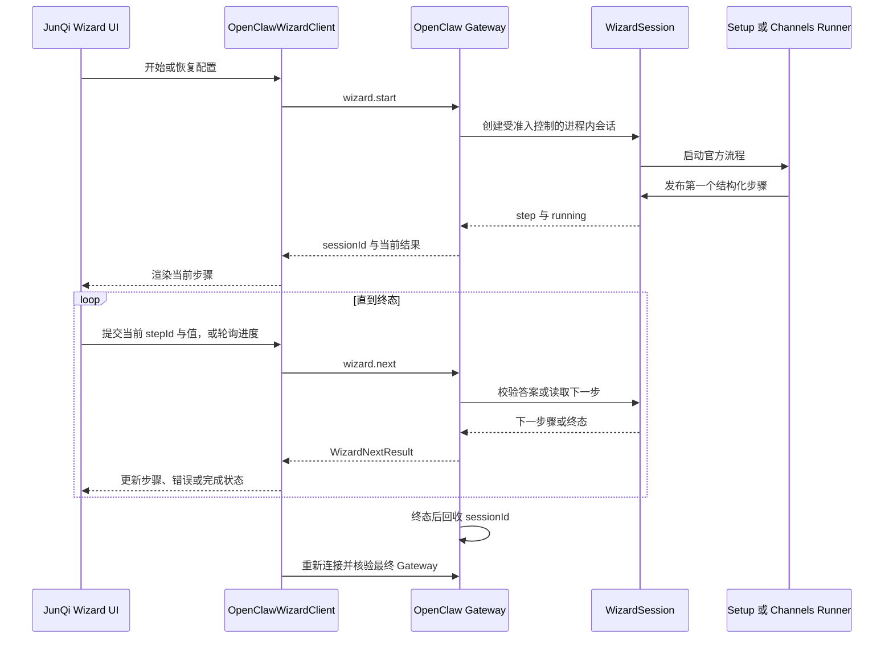

# OpenClaw `wizard.start` 流程与 JunQi 适配边界

更新时间：2026-08-11

本文整理 OpenClaw Gateway 交互式 Wizard 的正式协议、服务端会话状态机、完整配置流程和 JunQi 当前适配方式。它是实现与排障依据，不是客户端自定义向导规范。

## 依据与版本边界

- 最新上游依据为 2026-08-11 核验的 OpenClaw `main`，提交 `241e1accde4e04882a7343b2a8caa8bc94291f22`。
- 本机相邻 `Openclaw` 工作树停留在 `3075acd549a5c76ad776cd8be5edff8ee6d47b55`，落后上游，本文不以该本机快照替代最新官方契约。
- OpenClaw 实际安装版本只用于复现兼容差异。JunQi 不按版本号猜测字段，也不把本文记录的提交号写成能力开关。
- 请求对象使用封闭 schema。目标 Runtime 不接受某个最新字段时，客户端必须保留真实失败，不得静默改发另一套自定义协议。

## 一、总体调用链



协议只有四个 Gateway RPC：

| 方法 | 权限 | 作用 |
| --- | --- | --- |
| `wizard.start` | `operator.admin` | 创建官方 Wizard 会话并等待首个步骤或终态 |
| `wizard.next` | `operator.admin` | 提交当前步骤答案，或在不带答案时读取当前或下一步骤 |
| `wizard.cancel` | `operator.admin` | 请求取消尚未跨过持久化提交边界的会话 |
| `wizard.status` | `operator.admin` | 读取状态并回收该会话；不是恢复接口 |

## 二、`wizard.start` 请求

最新官方参数如下：

| 字段 | 类型 | 语义 |
| --- | --- | --- |
| `mode` | `local` 或 `remote` | 完整配置流程的运行方式 |
| `workspace` | 字符串 | 可选工作区输入，由官方流程继续校验和解析 |
| `installDaemon` | 布尔值 | 是否在官方收尾阶段处理后台服务安装 |
| `flow` | `setup` 或 `channels` | 缺省为完整 `setup`；`channels` 只运行渠道配置流程 |
| `channel` | 非空字符串 | `channels` 流程的预选渠道，不代表最终一定配置成功 |

完整首次配置的最小请求示例：

```json
{
  "mode": "local"
}
```

指定工作区时：

```json
{
  "mode": "local",
  "workspace": "/resolved/by/runtime"
}
```

独立渠道配置在最新协议中可以使用：

```json
{
  "flow": "channels",
  "channel": "provider-owned-channel-id"
}
```

`channel` 只是预选输入。客户端必须以终态返回的 `accounts` 和 `channels` 为真实结果，不能用请求值伪造已配置渠道。

### 服务端创建行为

1. Gateway 先按封闭 schema 验证参数。
2. 服务端通过统一 Setup 准入门禁创建会话。同一进程中已有 Wizard 时，新请求返回可重试的忙状态。
3. `setup` 流程还会取得配置迁移目标锁，避免与其他配置激活操作并发写同一状态目录。
4. Gateway 为会话生成新的 `sessionId`，并在内存中保存 `WizardSession`。
5. `setup` 调用官方 `runSetupWizard`；`channels` 调用官方 `runChannelsSetupWizard`。
6. `wizard.start` 等待第一个步骤或直接终态，不返回尚未产生任何内容的伪成功。
7. 若流程立即终止，Gateway 先等待 Runner 与准入门禁收敛，再回收会话。

## 三、返回对象

`wizard.start` 比 `wizard.next` 多一个非空 `sessionId`。两者共享以下结果字段：

| 字段 | 语义 |
| --- | --- |
| `done` | 当前会话是否已经到达终态 |
| `status` | `running`、`done`、`cancelled` 或 `error` |
| `step` | 当前结构化步骤；非终态时必须能被客户端识别 |
| `error` | 官方 Runner 或答案校验返回的错误 |
| `channels` | 渠道流程实际配置的渠道去重列表 |
| `accounts` | 渠道流程实际配置的 `channel` 与 `accountId` 对 |
| `preparedModelRef` | Provider 流程准备的确切模型引用；仍需后续真实激活核验 |

客户端不能从 `done: false`、空文本或超时推断配置已成功。只有官方终态与后续 Gateway 核验共同构成 JunQi 的完成条件。

## 四、步骤协议

官方步骤类型是开放流程中的封闭枚举：

| 类型 | 主要字段 | 客户端行为 |
| --- | --- | --- |
| `note` | `title`、`message`、`format` | 展示官方说明并提交当前 `stepId` 作为确认，不创造新的业务值 |
| `select` | `options`、`initialValue` | 选择一个官方选项并原样提交其 `value` |
| `text` | `placeholder`、`initialValue`、`sensitive` | 提交标量文本；敏感步骤不得显示或持久化预填值 |
| `confirm` | `message`、`initialValue` | 提交布尔值 |
| `multiselect` | `options`、`initialValue` | 提交官方选项值数组 |
| `progress` | `message`、`executor: gateway` | 不提交业务答案，使用无答案 `wizard.next` 获取后续进度或终态 |
| `action` | `executor` | `client` 执行器需要客户端确认；`gateway` 执行器由 Gateway 推进 |

每个步骤都有唯一 `id`。`wizard.next.answer.stepId` 必须对应当前待处理步骤；错误或过期的步骤号会得到 `wizard: no pending step`，客户端不得把它当作成功。

### 长选项搜索

OpenClaw 本地 `WizardPrompter` 的 `select` 与 `multiselect` 输入包含 `searchable` 展示提示，模型认证供应商的完整列表会显式传入 `searchable: true`。但当前 Gateway `WizardStep` schema 和 `WizardSessionPrompter` 不传输该字段，远程客户端无法从协议判断某一步是否为供应商搜索步骤。

JunQi 不按步骤标题、步骤编号、供应商或渠道名称猜测业务身份。官方 `select` 或 `multiselect` 返回至少七个选项时，统一提供只作用于当前页面的搜索框，并按官方 `label`、`hint` 和字符串 `value` 筛选。筛选不会改写、排序或补造选项，提交仍使用原始官方 `value`；短列表保持原有直接选择界面。

### 敏感信息

当 `sensitive` 为 `true` 时，Gateway 在步骤跨越客户端边界前删除 `initialValue`。JunQi 不应把输入值写入日志、状态快照、Markdown 或前端持久存储。

### 外部授权

- Runner 调用 `prompter.openUrl(url)` 后，OpenClaw 把该地址绑定到紧随其后的结构化步骤 `externalUrl`。
- `deviceCode` 是独立结构，包含非空 `code`，并可携带过期分钟数和说明。
- JunQi 可以把正式 `externalUrl` 本地编码成二维码，但二维码渲染成功不代表授权成功。
- 插件只在当前 `message` 中提供唯一 HTTPS 地址时，JunQi 只能把原地址作为展示派生数据；不得写回步骤、改变状态或从历史日志猜测地址。
- 用户提交授权步骤后，`wizard.next` 可以持续等待插件自己的轮询终态。JunQi 此时清除旧步骤的可交互投影并显示等待状态，不继续展示已经提交的二维码。
- 二维码可见不代表插件已经开始轮询。当前官方步骤仍等待用户确认时，JunQi 明确提示用户在完成外部授权后提交当前步骤，并使用授权专用操作文案；提交后才由同一个 `wizard.next` 请求等待插件结果。JunQi 不从扫码应用、窗口焦点或经过时间推断成功。
- 授权等待的超时、成功、失败与过期由官方 Runner 或插件拥有。JunQi 不设置更短的客户端请求时限，也不并行实现第二套渠道轮询；用户可以显式暂停当前客户端请求，稍后恢复同一官方会话。

### 进度步骤

Gateway 对突发进度做有界缓冲，只保留最早未读事件和最新快照。客户端应快速轮询 `progress`，不能假定收到每一次中间更新，也不能把缺少某条更新解释为任务失败。

## 五、`wizard.next` 循环

有输入步骤的请求：

```json
{
  "sessionId": "opaque-session-id",
  "answer": {
    "stepId": "current-step-id",
    "value": "official-option-value"
  }
}
```

恢复会话或轮询 Gateway 进度时不带 `answer`：

```json
{
  "sessionId": "opaque-session-id"
}
```

处理顺序：

1. Gateway 查找该进程内的会话；不存在时返回 `WIZARD_NOT_FOUND`。
2. 带答案时，先确认会话仍为 `running`，再按 `stepId` 交给 Runner。
3. 文本步骤只接受可转成字符串的标量；结构化对象不能被静默字符串化。
4. Runner 返回校验错误时，会话保持运行，响应保留当前步骤并携带 `error`，用户可以修正后再次提交。
5. 无答案调用返回未读进度、当前步骤、下一步骤或终态。
6. 到达终态后，Gateway 等待 Runner 收敛并回收 `sessionId`。后续继续使用旧标识会得到找不到会话。

## 六、完整 `setup` 流程

完整流程不是 JunQi 固定的五步表单。实际步骤由当前配置、用户选择、Provider、渠道插件和官方 Runner 动态产生。最新主线的主干顺序是：

1. 显示官方介绍，读取配置快照并要求风险确认。
2. 配置无效时展示问题并结束，要求先运行官方修复流程。
3. 展示插件兼容提示。
4. 选择保留已有模型、快速配置、高级配置或导入现有配置。
5. 需要导入时执行迁移检测、选择、校验和事务化提升。
6. 确定本地或远程 Gateway；远程流程保存远程连接配置后结束。
7. 本地流程选择并核验工作区，保留现有智能体目录与绑定边界。
8. 配置模型、Provider 凭据和 Gateway 参数，准备默认智能体路由。
9. 在适用时执行真实模型验证；失败时不保留未经验证的认证增量。
10. 持久化阶段性配置后进入渠道选择。跳过渠道也是官方 Wizard 的显式选择或参数结果，不由 JunQi 自动隐藏。
11. 创建工作区与会话基础文件，并按流程处理记忆导入、搜索和技能。
12. 高级流程继续处理官方插件、应用建议和插件配置。
13. 写入 Wizard 元数据，执行最终收尾，包括服务安装等由官方选项控制的操作。
14. Runner 正常返回后，`WizardSession` 进入 `done`。

快速配置、高级配置、导入流程的具体页面会随上游变化。JunQi 只按当前步骤渲染，不以本地步骤编号判断所处业务阶段。

## 七、独立 `channels` 流程

最新主线的 `flow: "channels"` 复用同一套步骤协议，但运行的是官方渠道添加流程：

1. 读取并校验当前配置；配置无效时直接返回错误。
2. 可按 `channel` 预选渠道，否则由官方插件目录动态列出可选渠道。
3. 由渠道插件自己的 Setup Wizard 定义凭据、账号、授权和路由步骤。
4. 在插件安装、配置提交等持久副作用发生前锁定取消操作。
5. 事务完成后提交配置，并记录实际配置的渠道账号。
6. 终态通过 `channels` 和 `accounts` 返回真实结果。

`channels` 流程把设备链接延后给客户端，但这不等于所有渠道都有二维码。只有插件正式提供 `externalUrl`、`deviceCode`，或声明相应 Web 登录 Gateway 方法并返回 `qrDataUrl` 时，JunQi 才能展示扫码入口。

## 八、取消、暂停、恢复与状态查询

### 取消

`wizard.cancel` 只接受 `sessionId`。会话仍在运行且尚未锁定取消时，Gateway：

1. 把状态改为 `cancelled`；
2. 中止 Runner；
3. 拒绝所有待回答步骤；
4. 清理进度；
5. Runner 收敛后回收会话。

渠道流程跨过持久副作用边界后可以拒绝取消。客户端必须保留返回的真实状态，不能声称已回滚。

### 暂停

OpenClaw 没有独立 `wizard.pause` RPC。JunQi 的“暂停并返回”只停止当前界面操作并保留按 Runtime 绑定的 `sessionId`，不调用取消，也不声称 Gateway Runner 已停止。

### 恢复

正确恢复方式是对原 `sessionId` 调用不带答案的 `wizard.next`。Wizard 会返回当前未完成步骤、进度或终态。

`wizard.status` 在当前官方 handler 中读取状态后立即回收会话，因此不能用作恢复前探测。JunQi 不调用它来恢复。

### Gateway 重启后的会话丢失

Wizard 会话存在于 Gateway 进程内。Gateway 重启后，原 `sessionId` 可能得到 `WIZARD_NOT_FOUND`。JunQi 先清除该运行时范围内的旧标识，通过统一生命周期恢复当前所选 Gateway 的认证连接，并确认原会话确实不可恢复。此时官方协议没有提供跨进程终态查询，JunQi 必须保留“终态未知”，不得重放旧答案，也不得根据配置文件、健康状态、页面标题或本地缓存伪造完成或失败。页面恢复不会自动调用 `wizard.start`；用户显式重新开始前必须通过可取消的确认对话框了解可能重复持久写入的风险。

最新 OpenClaw 主线在 `wizard.start` 创建会话后调用 `retainGatewayWorkUntilSettled`，保持 Gateway 工作准入直到 Runner 收敛，避免配置 reload 清除进程内会话。当前安装运行时是否包含该修复必须按实际官方源码或可复现行为核验，不能用版本字符串猜测。

## 九、JunQi 当前实现

### 前置门禁

1. 用户已经明确选择 Native 或 Docker Runtime。
2. JunQi 已核验 Gateway 目标、凭据和 Runtime Identity。
3. 首次配置默认由正式 `openclaw.setup.detect` 与 Guided 流程判断既有配置；Classic Wizard 只在用户显式选择详细配置时启动。
4. Wizard RPC 使用经授权的 `operator.admin` 临时管理连接。

### 当前首次配置请求

JunQi 首次启动只发起完整官方配置：

```json
{
  "mode": "local",
  "workspace": "仅在用户明确选择时提供"
}
```

当前首次配置不发送 `flow: "channels"`。完整 `setup` 本身已经包含官方渠道步骤。工作台渠道中心的新增和重新配置入口使用独立的 `wizard.start { flow: "channels", channel }`；setup 与每个渠道的会话存储相互隔离。部分旧 Runtime 会按封闭 schema 拒绝后来新增的 `flow` 字段，只有收到结构化 `INVALID_REQUEST` 时才显示官方终端渠道配置交接，不以版本号推断能力。

### 会话所有权

- JunQi 只持久化不透明 `sessionId`，不保存答案、凭据或步骤副作用。
- 存储键绑定 `runtimeMode` 与规范化 Gateway WebSocket URL；Native、Docker 和不同 Gateway 目标之间不能复用会话。
- 重新进入页面时优先使用无答案 `wizard.next` 恢复。
- 开始新的完整流程前，若当前范围仍有会话，客户端先请求官方取消；会话已经丢失时清除旧标识并保留终态未知，不隐式启动新流程。

### 界面投影

- `text`、`confirm`、`select`、`multiselect`、`note`、`progress`、`action` 由统一步骤注册表渲染。
- `select` 与 `multiselect` 的长选项集合复用同一搜索组件；该组件只过滤当前官方选项，不识别或维护本地供应商、模型与渠道目录。
- 未识别的新步骤类型会明确要求升级 JunQi，不把它降级为任意文本框。
- 已知字段逐项严格校验；未知新增字段只记录诊断并忽略，不阻断其他已知字段。
- `progress` 且 `executor: "gateway"` 时自动使用无答案 `wizard.next` 轮询。
- 正常交互步骤默认收起日志，连接、等待和失败状态展开日志。
- `externalUrl` 与 `deviceCode` 由共享授权组件呈现，二维码只在本地生成。

### 终态处理

官方结果为 `done` 后，JunQi 仍需：

1. 捕获当前已核验 Gateway 连接及其 Runtime 身份；
2. 只有该连接已经失效时，才通过全局 Gateway 生命周期协调器重新解析目标和凭据并重连；
3. 在同一连接标识围栏内探测用户所选 Gateway；
4. 调用官方 `openclaw.setup.detect` 核验配置终态；
5. 调用官方 `openclaw.setup.verify` 完成真实模型核验；
6. 所有门禁通过后才进入完成页。

Wizard 完成不等于桌面客户端已经连接到正确 Runtime。上述核验失败时必须停留在配置页面，并保留“官方终态已确认”的本地派生恢复状态。此后的“重新核验”只重复连接围栏、所选 Runtime、配置终态和真实模型核验；当前连接失效时才重连。该恢复不调用 `wizard.start`、`wizard.next`，也不恢复或重放已经回收的官方会话。

## 十、错误分类与恢复动作

| 现象 | 官方含义 | JunQi 动作 |
| --- | --- | --- |
| `wizard not found` 或 `WIZARD_NOT_FOUND` | 进程内会话不存在或已回收，旧 Runner 终态不可查询 | 清除当前 Runtime 的旧标识并保留终态未知；只允许用户知情后显式新建流程 |
| `wizard not running` | 会话不再接受答案，但该错误本身不携带终态结果 | 不重放答案；尝试无答案恢复，无法恢复时保留终态未知 |
| `wizard: no pending step` | 客户端步骤与服务端当前步骤不同步 | 使用无答案 `wizard.next` 恢复当前步骤 |
| Setup 正在进行 | 准入门禁拒绝并发会话 | 保留可重试状态，不创建第二套本地流程 |
| 普通 Wizard 请求超时 | 结果未知 | 先恢复同一会话，不自动重放带副作用的答案 |
| 授权插件仍在轮询 | 当前 `wizard.next` 尚未返回终态 | 保持等待投影，允许显式暂停；不由客户端超时或并行轮询 |
| Gateway 身份或连接变化 | 请求来源不再绑定原 Runtime | 重新核验目标和凭据，再尝试恢复官方会话 |
| 官方 `done` 后 Gateway 核验失败 | 官方配置已终态，本地运行时交接未完成 | 只重新执行运行时交接与身份核验，不重新启动 Wizard |
| 未识别步骤类型 | JunQi 落后于 Gateway 协议 | 明确提示升级，不猜测控件和提交值 |
| 终态 `error` | 官方 Runner 失败 | 展示经脱敏的原始诊断，不伪造成功 |

## 十一、禁止实现

- 不按渠道名称硬编码 Wizard 步骤、二维码能力或成功条件。
- 不向封闭请求对象添加 `qrContent` 等自定义字段，也不为官方 `sessionId` 补造恢复字段或客户端状态。
- 不使用 `wizard.status` 作为恢复探测。
- 不把“暂停并返回”描述成取消或回滚。
- 不在本地重放已经提交的凭据或写操作。
- 不把 `sessionId` 跨 Runtime、跨 Gateway 地址复用。
- 不因当前安装版本缺少最新字段就静默切换到另一套本地向导。
- classic Wizard 不使用 `openclaw.setup.detect` 或 `openclaw.setup.verify` 补造 `wizard.next` 的终态。两个 setup 方法属于最新版 guided inference 的正式协议，应在独立 guided 流程中使用，不能与 classic session 终态混用。
- 不把 `preparedModelRef`、`accounts` 或二维码显示解释为实际模型、渠道已经可用；仍需官方激活或状态核验。

## 十二、官方源码依据

- [Wizard Gateway 协议 schema](https://github.com/openclaw/openclaw/blob/main/packages/gateway-protocol/src/schema/wizard.ts)
- [Wizard Gateway handlers](https://github.com/openclaw/openclaw/blob/main/src/gateway/server-methods/wizard.ts)
- [WizardSession 与步骤桥接](https://github.com/openclaw/openclaw/blob/main/src/wizard/session.ts)
- [Setup 准入与互斥](https://github.com/openclaw/openclaw/blob/main/src/gateway/server-methods/setup-admission.ts)
- [完整 Setup Runner](https://github.com/openclaw/openclaw/blob/main/src/wizard/setup.ts)
- [独立 Channels Runner](https://github.com/openclaw/openclaw/blob/main/src/commands/channels/add-wizard.ts)
- [Gateway 方法权限描述](https://github.com/openclaw/openclaw/blob/main/src/gateway/methods/core-descriptors.ts)

## 十三、JunQi 实现依据

- [`src/services/openclawWizard.ts`](../../src/services/openclawWizard.ts)
- [`src/hooks/useSetupFlow/useWizardSession.ts`](../../src/hooks/useSetupFlow/useWizardSession.ts)
- [`src/pages/SetupPage/WizardScreen.tsx`](../../src/pages/SetupPage/WizardScreen.tsx)
- [`src/pages/SetupPage/wizard/WizardStepRenderer.tsx`](../../src/pages/SetupPage/wizard/WizardStepRenderer.tsx)
- [`src/pages/SetupPage/wizard/WizardAuthorizationHint.tsx`](../../src/pages/SetupPage/wizard/WizardAuthorizationHint.tsx)

第三方平台、插件归属、授权方式和扫码能力见 [OpenClaw 第三方渠道支持](../channels/openclaw-third-party-channel-support.md)。
